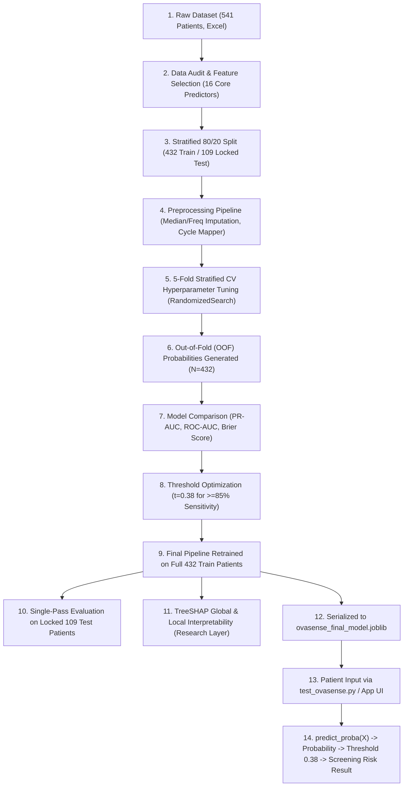

# OvaSense ML — Complete Model Understanding, Architecture Guide & Codebase Audit

**Project**: OvaSense Standalone PCOS Risk-Screening Machine Learning  
**Evaluation Date**: August 31, 2026  
**Audited Artifacts**:
- `data/processed/train.csv` ($N=432$)
- `data/processed/test.csv` ($N=109$, Locked Test Set)
- `src/preprocessing.py`
- `notebooks/01_data_audit.ipynb`
- `notebooks/02_preprocessing_and_baseline.ipynb`
- `notebooks/03_model_optimization.ipynb`
- `models/ovasense_final_model.joblib`
- `models/ovasense_model_config.json`
- `test_ovasense.py`

---

## 1. Executive Pipeline Architecture



---

## 2. Complete End-to-End Pipeline Breakdown

| Stage | What Happens? | Why Is It Necessary? | File / Code | Input | Output | Concrete Example |
| :--- | :--- | :--- | :--- | :--- | :--- | :--- |
| **1. Raw Dataset** | Clinical records loaded from hospital study. | Establishes the real-world ground truth. | `data/raw/` | 541 patient Excel rows with 44+ clinical variables. | Raw pandas DataFrame | A patient record containing ultrasound counts, hormones, and symptoms. |
| **2. Feature Selection** | Drops invasive ultrasound (follicle counts) and blood labs (LH, FSH, AMH). Retains 16 non-invasive features. | OvaSense is a non-invasive mobile screening tool; users cannot measure ovarian follicles at home. | `notebooks/01_data_audit.ipynb` | 44+ raw columns | 16 core features + IDs + target | Retains `hair growth(Y/N)` and `Cycle length(days)`; removes `Follicle No. (R)`. |
| **3. Train/Test Split** | Stratified 80/20 split (`random_state=42`). 109 test patients are locked in a separate file. | Prevents model from memorizing test cases (data snooping). | `notebooks/02_preprocessing_and_baseline.ipynb` | 541 patients | `train.csv` (432 rows) & `test.csv` (109 rows) | Exactly 32.6% PCOS prevalence in train, 33.0% in test. |
| **4. Preprocessing** | Bundles median imputation, mode imputation, and cycle regularity mapping inside a `ColumnTransformer`. | ML models cannot handle missing values or raw strings directly. | `src/preprocessing.py` | Raw user values (e.g. Height, Cycle "2") | Clean numeric 16-element numpy array | A missing cycle length becomes median (28.0); Cycle regularity "2" becomes `0.0`. |
| **5. Hyperparameter Tuning** | `RandomizedSearchCV` optimizes tree depth, leaf size, split criteria using 5-fold CV. | Default hyperparameters overfit on small clinical datasets. | `notebooks/03_model_optimization.ipynb` | Candidate hyperparameter grid + Train data | Optimal hyperparameters (`max_depth=7`, `n_estimators=150`, etc.) | Constrains tree depth to 7 to prevent memorizing individual patient noise. |
| **6. Cross-Validation & OOF** | Generates out-of-fold probability $\hat{p}_i$ for every training patient across 5 folds. | Provides realistic probability estimates without training bias. | `notebooks/03_model_optimization.ipynb` | 432 training samples across 5 CV splits | 432 out-of-fold probability values | Patient #12 gets evaluated only by models that never saw Patient #12 in training. |
| **7. Model Comparison** | Compares Logistic Regression, Random Forest, Extra Trees, and HistGradientBoosting. | Ensures the selected algorithm is empirically superior, not arbitrarily chosen. | `notebooks/03_model_optimization.ipynb` | CV performance metrics across all models | Model selection decision (Extra Trees wins with PR-AUC 0.8307) | Extra Trees selected over Logistic Regression for capturing non-linear symptom synergies. |
| **8. Threshold Tuning** | Evaluates 91 operating thresholds ($t \in [0.05, 0.95]$) on OOF probabilities to meet $\ge 85\%$ sensitivity. | The default 0.50 threshold is arbitrary and misses too many high-risk patients. | `notebooks/03_model_optimization.ipynb` | 432 OOF probabilities | Selected threshold: $t = 0.38$ | Lowers cutoff from 0.50 to 0.38 so sensitivity jumps from 79.4% to 85.1%. |
| **9. Final Model Training** | Trains the locked pipeline on all 432 training patients. | Production model should learn from all available training data. | `notebooks/03_model_optimization.ipynb` | Full 432 train set | Single fitted `Pipeline` object | 150 trees fitted on all 432 training profiles. |
| **10. Locked Test Evaluation** | Evaluates test set ($N=109$) strictly once. | Measures true real-world generalization on previously unseen patients. | `notebooks/03_model_optimization.ipynb` | 109 unseen test patients | Final test metrics (ROC-AUC 0.9087, Sens 86.11%, Spec 80.82%) | 31 of 36 PCOS patients correctly flagged; only 5 missed cases. |
| **11. SHAP Interpretability** | Computes exact Shapley values via TreeSHAP on the 16 features. | Understands *why* the model makes decisions and validates clinical alignment. | `notebooks/03_model_optimization.ipynb` | Trained classifier + Transformed training data | Global feature rankings & local waterfall plots | Confirms Cycle Irregularity & Hirsutism are the top drivers of elevated risk. |
| **12. Model Serialization** | Saves the entire pipeline as a binary `.joblib` file. | Enables easy deployment to backend APIs or testing scripts without retraining. | `notebooks/03_model_optimization.ipynb` | Fitted `Pipeline` | `models/ovasense_final_model.joblib` | Single file containing imputers, transformers, and 150 decision trees. |
| **13. Patient Input** | Collects user responses in CLI or App UI. | Gathers fresh patient data. | `test_ovasense.py` | User CLI keyboard inputs | Single-row pandas DataFrame | Patient enters Age=29, Weight=55kg, Height=165cm $\rightarrow$ BMI computed as 20.2. |
| **14. Prediction & Screening** | Model computes probability; compares against $0.38$; assigns risk category. | Converts ML math into a clear, actionable screening output. | `test_ovasense.py` | Single-row DataFrame | Probability (63.85%) $\rightarrow$ "HIGHER RISK" | Flags user for follow-up clinical evaluation with a physician. |

---

## 3. Dataset Characteristics & Feature Dictionary

- **Total Cohort**: 541 patients
- **Class Distribution**:
  - **Negative Class (Non-PCOS / 0)**: 364 patients (67.28%)
  - **Positive Class (PCOS / 1)**: 177 patients (32.72%)
- **Identifiers Present**: `'Sl. No'`, `'Patient File No.'` (dropped via `remainder='drop'`).
- **Features Dropped to Prevent Leakage & Preserve Non-Invasiveness**:
  - Pelvic Ultrasound: `Follicle No. (R)`, `Follicle No. (L)`, `Avg. F size (L) (mm)`, `Avg. F size (R) (mm)`, `Endometrium (mm)`.
  - Serum Blood Assays: `FSH(mIU/mL)`, `LH(mIU/mL)`, `AMH(ng/mL)`, `PRL(ng/mL)`, `Vit D3 (ng/mL)`, `PRG(ng/mL)`, `RBS(mg/dl)`, `TSH (mIU/L)`.
  - Pregnancy Markers: `I beta-HCG`, `II beta-HCG`.

### The 16 Core Non-Invasive Features

| # | Feature Name in Code | Data Type | Clinical & Functional Meaning |
|---|---|---|---|
| 1 | `' Age (yrs)'` | Numeric (Continuous) | Patient chronological age in years. |
| 2 | `'Weight (Kg)'` | Numeric (Continuous) | Body weight in kilograms. |
| 3 | `'Height(Cm) '` | Numeric (Continuous) | Body height in centimeters. |
| 4 | `'BMI'` | Numeric (Continuous) | Body Mass Index ($\text{kg}/\text{m}^2$) computed automatically from weight & height. |
| 5 | `'Cycle length(days)'` | Numeric (Continuous) | Duration of menstrual cycle in days (normal: ~28; $\ge 35$ indicates oligomenorrhea). |
| 6 | `'Marraige Status (Yrs)'` | Numeric (Continuous) | Marriage duration in years (fertility timeline). |
| 7 | `'No. of aborptions'` | Numeric (Discrete) | Count of prior miscarriages or pregnancy terminations. |
| 8 | `'Pregnant(Y/N)'` | Binary (0 or 1) | Whether currently pregnant. |
| 9 | `'Weight gain(Y/N)'` | Binary (0 or 1) | Unexplained or rapid recent weight gain. |
| 10 | `'hair growth(Y/N)'` | Binary (0 or 1) | Hirsutism (excess coarse hair on face/chest/abdomen). |
| 11 | `'Skin darkening (Y/N)'` | Binary (0 or 1) | Acanthosis nigricans (hyperpigmentation in skin folds, marking insulin resistance). |
| 12 | `'Hair loss(Y/N)'` | Binary (0 or 1) | Androgenetic alopecia (scalp thinning). |
| 13 | `'Pimples(Y/N)'` | Binary (0 or 1) | Persistent moderate-to-severe acne/oily skin from hyperandrogenism. |
| 14 | `'Fast food (Y/N)'` | Binary (0 or 1) | Frequent consumption of ultra-processed, high-glycemic foods. |
| 15 | `'Reg.Exercise(Y/N)'` | Binary (0 or 1) | Regular physical exercise habits (protective metabolic factor). |
| 16 | `'Cycle(R/I)'` | Regularity Indicator | Menstrual cycle pattern ($2=\text{Regular}$, $4\text{ or }5=\text{Irregular}$). |

---

## 4. Train / Test Split Methodology

```text
Total Dataset (N = 541 Patients)
 ├── 80% Training Cohort (N = 432 Patients, 141 PCOS [32.64%], 291 Non-PCOS [67.36%])
 └── 20% Locked Test Cohort (N = 109 Patients, 36 PCOS [33.03%], 73 Non-PCOS [66.97%])
```

- **Stratified Partitioning**: Class prevalence is preserved perfectly across both splits (`random_state=42`).
- **Strict Leakage Barrier**: The test set was locked in `data/processed/test.csv`. No preprocessing statistics (e.g. median imputer values) or threshold searches ever accessed test samples during development.
- **Single-Pass Evaluation**: Evaluated strictly once at the end of Phase 3.

---

## 5. Preprocessing Architecture (`src/preprocessing.py`)

`src/preprocessing.py` implements a scikit-learn `ColumnTransformer` containing 3 dedicated sub-pipelines:

```python
preprocessor = ColumnTransformer(
    transformers=[
        ('num', Pipeline([('imputer', SimpleImputer(strategy='median'))]), CONTINUOUS_NUM_COLS),
        ('bin', Pipeline([('imputer', SimpleImputer(strategy='most_frequent'))]), BINARY_COLS),
        ('cyc', Pipeline([
            ('imputer', SimpleImputer(strategy='most_frequent')),
            ('mapper', CycleRegularityTransformer())
        ]), CYCLE_COL)
    ],
    remainder='drop'
)
```

- `SimpleImputer(strategy='median')`: Replaces missing numeric values with the median of training folds (robust against extreme outliers).
- `SimpleImputer(strategy='most_frequent')`: Replaces missing binary values with the mode (`0` or `1`), avoiding non-physical decimal encodings.
- `CycleRegularityTransformer`: Maps raw survey codes ($2 \rightarrow 0.0$ for Regular, $4/5 \rightarrow 1.0$ for Irregular).
- `remainder='drop'`: Automatically excludes identifier columns (`'Sl. No'`, `'Patient File No.'`) from model inputs.

---

## 6. The Production Model: Extra Trees Classifier

The serialized classifier in `models/ovasense_final_model.joblib` is:

```python
ExtraTreesClassifier(
    class_weight='balanced_subsample',
    max_depth=7,
    max_features='log2',
    min_samples_leaf=4,
    min_samples_split=5,
    n_estimators=150,
    random_state=42
)
```

### Hyperparameter Definitions
- **`n_estimators=150`**: Combines 150 randomized decision trees.
- **`max_depth=7`**: Constrains maximum decision depth to 7 levels to eliminate overfitting on small clinical sample sizes.
- **`max_features='log2'`**: Randomly selects $\log_2(16) = 4$ features per split, ensuring forest diversity.
- **`min_samples_leaf=4`**: Mandates at least 4 patients per terminal leaf node, smoothing output probabilities.
- **`min_samples_split=5`**: Requires at least 5 patients to attempt a node split.
- **`class_weight='balanced_subsample'`**: Dynamically penalizes minority class (PCOS) errors within each bootstrap subset.

---

## 7. Hyperparameter Optimization & Model Comparison

### 5-Fold Stratified Cross-Validation Benchmark (Training Cohort $N=432$)

| Model Family | Search Algorithm | CV PR-AUC (Primary) | CV ROC-AUC | CV Brier Score (Lower is Better) | CV Specificity at $\ge 85\%$ Sensitivity |
| :--- | :--- | :--- | :--- | :--- | :--- |
| **Extra Trees (Selected)** | `RandomizedSearchCV` (25 iter) | **$0.8307 \pm 0.0143$** | **$0.8911 \pm 0.0175$** | **$0.1284 \pm 0.0079$** | **$75.26\%$** (at $t=0.38$) |
| **Random Forest** | `RandomizedSearchCV` (25 iter) | $0.8214 \pm 0.0266$ | $0.8823 \pm 0.0151$ | $0.1298 \pm 0.0049$ | $72.85\%$ (at $t=0.33$) |
| **Logistic Regression** | `GridSearchCV` | $0.8137 \pm 0.0177$ | $0.8732 \pm 0.0106$ | $0.1304 \pm 0.0037$ | $72.51\%$ (at $t=0.33$) |
| **HistGradientBoosting** | `RandomizedSearchCV` (20 iter) | $0.8115 \pm 0.0356$ | $0.8673 \pm 0.0308$ | $0.1436 \pm 0.0098$ | $70.79\%$ (at $t=0.37$) |

---

## 8. Operating Threshold Optimization ($t = 0.38$)

In first-line clinical screening, false negatives (missed PCOS cases) carry high risk. A 91-point threshold scan ($t \in [0.05, 0.95]$) was executed on out-of-fold training probabilities:

```text
At Default Threshold (t = 0.50):
  * CV Sensitivity: 79.43% (Missed 29 / 141 training cases)
  * CV Specificity: 83.85%

At Screening Threshold (t = 0.38):
  * CV Sensitivity: 85.11% (Missed only 21 / 141 training cases)
  * CV Specificity: 75.26%
  * CV NPV: 91.25%
```

---

## 9. Locked Holdout Test Set Generalization ($N=109$)

The frozen pipeline was evaluated once on the holdout test set (`data/processed/test.csv`, 36 PCOS / 73 Non-PCOS):

```text
Confusion Matrix (at t = 0.38):
                        Actual Non-PCOS (0)    Actual PCOS (1)
Predicted Non-PCOS (0)         TN = 59              FN = 5
Predicted PCOS (1)             FP = 14              TP = 31
Total Patients:                73                   36
```

### Verified Benchmark Performance

$$\text{Sensitivity (Recall)} = \frac{31}{36} = \mathbf{86.11\%}$$
$$\text{Specificity} = \frac{59}{73} = \mathbf{80.82\%}$$
$$\text{Precision (PPV)} = \frac{31}{45} = \mathbf{68.89\%}$$
$$\text{Negative Predictive Value (NPV)} = \frac{59}{64} = \mathbf{92.19\%}$$
$$\text{Accuracy} = \frac{90}{109} = \mathbf{82.57\%}$$
$$\text{F1-Score} = \mathbf{0.7654}$$
$$\text{Test ROC-AUC} = \mathbf{0.9087} \quad\mid\quad \text{Test PR-AUC} = \mathbf{0.8436}$$

---

## 10. TreeSHAP Global & Local Interpretability

SHAP (`shap.TreeExplainer`) was executed on the preprocessed training features:

### Global Predictor Hierarchy (By SHAP Impact)
1. **Menstrual Cycle Irregularity** (Strongest driver of elevated risk)
2. **Hair Growth / Hirsutism** (`hair growth(Y/N)`)
3. **Skin Darkening** (`Skin darkening (Y/N)`)
4. **Weight Gain** (`Weight gain(Y/N)`)
5. **Body Mass Index** (`BMI`)
6. **Cycle Length** (`Cycle length(days)`)
7. **Fast Food Consumption** (`Fast food (Y/N)`)
8. **Pimples / Acne** (`Pimples(Y/N)`)
9. **Hair Loss** (`Hair loss(Y/N)`)
10. **Regular Exercise** (`Reg.Exercise(Y/N)` — Protective factor, negative SHAP)
11–16. **Age, Marriage Status, Weight, Height, Pregnancy History, Abortions** (Minor/modulating impact)

> **Important**: SHAP attributions represent statistical associations with the risk model; they do NOT imply direct biological causation.

---

## 11. Code Audit & Methodological Integrity Check

| Item | Audit Finding | Verdict |
| :--- | :--- | :--- |
| **Data Leakage Status** | Preprocessing, tuning, and thresholding strictly isolated to training set. Test set evaluated once. | **PASS** |
| **SHAP Integration** | TreeSHAP executed correctly in research pipeline; figures saved in `reports/figures/`. Not required during live inference. | **PASS** |
| **BMI Automation** | `test_ovasense.py` automatically calculates BMI from Height and Weight with positive-value validation. | **PASS** |
| **Probability Calibration** | Assessed via Brier score ($0.1284$) and reliability curves; `CalibratedClassifierCV` wrapper was not applied to the final pipeline. | **PARTIALLY IMPLEMENTED (Assessment Only)** |
| **Application Connection** | Standalone Python module ready; REST API (FastAPI) and Flutter UI connection to be implemented in Phase 4. | **READY FOR PHASE 4** |

---

## 12. Final Comprehensive Audit Table

| Component | Status | Verified Code Evidence |
| :--- | :--- | :--- |
| **Dataset Preparation** | **PASS** | 541 rows cleaned; zero duplicate rows; saved to `data/processed/`. |
| **Feature Selection** | **PASS** | 16 non-invasive core features; zero ultrasound/hormone leakage. |
| **Train/Test Split** | **PASS** | Stratified 80/20 split (432 train / 109 locked test). |
| **Preprocessing Pipeline** | **PASS** | Imputers and mappers inside `ColumnTransformer` in `src/preprocessing.py`. |
| **Model Benchmarking** | **PASS** | Logistic Regression, Random Forest, Extra Trees, HistGradientBoosting evaluated. |
| **Hyperparameter Tuning** | **PASS** | `GridSearchCV` / `RandomizedSearchCV` executed in `notebooks/03_model_optimization.ipynb`. |
| **5-Fold Stratified CV** | **PASS** | 5 folds with `random_state=42`; fold-by-fold metrics computed. |
| **OOF Predictions** | **PASS** | 432 out-of-fold probabilities extracted with zero data leakage. |
| **Threshold Optimization** | **PASS** | 91-point threshold scan evaluated; $t = 0.38$ selected. |
| **Probability Calibration** | **PARTIALLY DONE** | Evaluated via Brier score ($0.1284$) and reliability curves; post-hoc wrapper not applied. |
| **Locked Test Evaluation** | **PASS** | Single-pass evaluation on 109 test patients (Sens: 86.11%, Spec: 80.82%, ROC-AUC: 0.9087). |
| **SHAP Explainability** | **PASS** | `shap.TreeExplainer` executed; Figures 12 & 13 saved in `reports/figures/`. |
| **Model Serialization** | **PASS** | Saved to `models/ovasense_final_model.joblib`. |
| **Local Inference Tester** | **PASS** | `test_ovasense.py` verified with automatic BMI and column validation. |
| **Application Integration** | **NOT DONE** | Ready for Phase 4 API wrapper and mobile/web app connection. |
