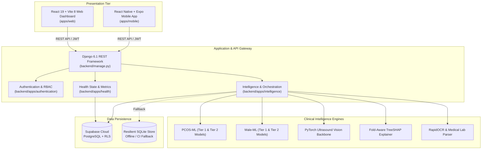

# BioPulse AI — Risk Assessment

> **Intelligent Clinical Health Risk Assessment, Dual-Pathway Reproductive & Endocrine Stratification, and Patient Monitoring Platform.**

[](https://github.com/MHamzaAhmed-dev/biopulse-ai-risk-assessment/actions/workflows/frontend-ci.yml)
[](https://github.com/MHamzaAhmed-dev/biopulse-ai-risk-assessment/actions/workflows/backend-ci.yml)
[](https://github.com/MHamzaAhmed-dev/biopulse-ai-risk-assessment/actions/workflows/ml-ci.yml)
[](https://github.com/MHamzaAhmed-dev/biopulse-ai-risk-assessment/actions/workflows/security-ci.yml)

---

## Non-Diagnostic Medical Disclaimer

> [!IMPORTANT]
> **BioPulse AI is an AI-assisted health risk assessment and monitoring research project.**
> It is **NOT** a replacement for professional medical diagnosis, clinical judgment, prescription, or individualized clinical advice. The risk scores, factor attributions, and explainability cards provided by this system are designed to augment clinical discussions between patients and certified healthcare providers. Users should always consult qualified healthcare professionals regarding any health concerns or symptoms.

---

## 1. Project Overview

**BioPulse AI** is a multi-modal clinical intelligence platform engineered to identify early risk markers and assist in continuous longitudinal tracking for complex endocrine and reproductive health conditions:
- **Female Reproductive Pathway**: Polycystic Ovary Syndrome (PCOS) risk screening using a progressive two-tier structure (16 phenotypic features + 32 cumulative biochemical/vital features) complemented by deep learning ultrasound vision (EfficientNet-B0 + Grad-CAM).
- **Male Endocrine Pathway**: Late-Onset Hypogonadism and testosterone deficiency risk stratification (11 symptomatic features + 16 endocrine lab panel biomarkers) with longitudinal digital twin tracking.
- **Explainable AI (TreeSHAP)**: Every continuous risk prediction includes transparent, fold-averaged local SHAP feature importance vectors, transforming model outputs into actionable clinical insights.

---

## 2. System Architecture



---

## 3. Team Responsibilities & Ownership

To maintain high code quality and clear separation of concerns, the repository is organized into distinct ownership domains:

| Subsystem | Primary Path | Responsibilities | Domain Owner |
| :--- | :--- | :--- | :--- |
| **Frontend / UI / UX** | `apps/web/` | React 19 UI, component libraries, responsive styling (Tailwind CSS 4), 3D anatomical models (Three.js), client API integration, accessibility. | `@MHamzaAhmed-dev` |
| **Machine Learning** | `machine-learning/` | Dataset curation, feature engineering, model training, calibrated artifact serialization (`.joblib`), TreeSHAP explainability, ultrasound vision models. | `@ML_OWNER` |
| **Backend & APIs** | `backend/` | Django 6.1, Django REST Framework, authentication, database migrations, clinical state machine, local fallback persistence, API validation. | `@BACKEND_OWNER` |
| **Shared Infrastructure** | `.github/`, `docs/` | CI/CD pipelines, repository security, interface contracts, issue templates, release management. | Maintainers |

*Cross-domain changes should be submitted via Pull Requests with targeted reviews from the corresponding code owners.*

---

## 4. Repository Structure

```
biopulse-ai-risk-assessment/
│
├── apps/
│   ├── web/                    # React 19 + Vite 8 Web Application
│   │   ├── src/                # Components, pages, hooks, contexts
│   │   ├── public/             # Static public assets
│   │   ├── package.json        # Frontend dependencies & scripts
│   │   └── vite.config.ts      # Vite bundler configuration
│   └── mobile/                 # React Native + Expo Mobile Application
│
├── backend/                    # Django & Django REST Framework Service
│   ├── apps/
│   │   ├── authentication/     # Supabase auth bridge & user sessions
│   │   ├── health/             # Metrics, symptoms, food/water tracking
│   │   └── intelligence/       # ML inference adapters & state persistence
│   ├── config/                 # Django settings, URLs, ASGI/WSGI
│   ├── manage.py               # Django management CLI
│   └── requirements.txt        # Backend Python dependencies
│
├── machine-learning/           # Statistical Learning & Model Artifacts
│   ├── PCOS-ML/                # Female PCOS models (Tier 1 & Tier 2)
│   ├── male-ML/                # Male hypogonadism models (Tier 1 & Tier 2)
│   ├── ml/                     # Shared training, inference & explainability
│   ├── test_production_models.py # Production artifact validation suite
│   ├── requirements.txt        # ML dependencies
│   └── README.md               # Model policy & governance rules
│
├── docs/                       # Technical & Architectural Documentation
│   ├── architecture/           # System topology & layer designs
│   ├── api/                    # Risk assessment interface contract
│   ├── ml/                     # Model registry & fairness policies
│   └── development/            # Local setup guides
│
├── scripts/                    # Development automation & runner scripts
│   └── run-python.mjs          # Cross-platform venv/python resolution script
│
├── supabase/                   # Supabase database schema & SQL migrations
│   ├── migrations/             # Timestamped SQL migration files
│   └── schema.sql              # Consolidated PostgreSQL schema
│
├── .github/                    # CI/CD & GitHub Collaboration
│   ├── workflows/              # GitHub Actions workflows (Frontend, Backend, ML, Security)
│   ├── ISSUE_TEMPLATE/         # Bug report & feature request templates
│   ├── pull_request_template.md # Standard PR checklist and template
│   └── CODEOWNERS              # Path-based team code ownership
│
├── .env.example                # Sanitized environment variable template
├── .gitignore                  # Production exclusion rules
├── CONTRIBUTING.md             # Contribution guide, Git branching & commits
├── package.json                # Monorepo root orchestration scripts
└── README.md                   # This root documentation file
```

---

## 5. Development Setup

### Quick Start
```bash
# 1. Clone the repository
git clone https://github.com/MHamzaAhmed-dev/biopulse-ai-risk-assessment.git
cd biopulse-ai-risk-assessment

# 2. Configure environment
cp .env.example .env

# 3. Install frontend dependencies
npm run install:all

# 4. Set up backend virtual environment
python -m venv backend/venv
.\backend\venv\Scripts\pip install -r backend/requirements.txt  # Windows
# source backend/venv/bin/activate && pip install -r backend/requirements.txt  # macOS/Linux

# 5. Launch full stack concurrently
npm run dev
```

For detailed per-subsystem setup, see [docs/development/setup-and-workflow.md](docs/development/setup-and-workflow.md).

---

## 6. Git Branching Strategy & Workflow

```
feature branch (feature/ui-*, feature/ml-*, feature/backend-*)
               │
               ▼
         Pull Request
               │
               ▼
     Automated CI Verification (Frontend + Backend + ML + Security)
               │
               ▼
          Code Review
               │
               ▼
            develop (Integration Branch)
               │
               ▼
       Release Validation
               │
               ▼
             main (Production / Stable Branch)
```

### Branch Naming Convention
- Frontend: `feature/ui-risk-dashboard`, `feature/ui-radar-chart`
- Machine Learning: `feature/ml-pcos-calibration`, `feature/ml-male-tier2-shap`
- Backend: `feature/backend-assessment-endpoint`, `feature/backend-sqlite-fallback`
- Bug fixes: `fix/ui-contrast-ratio`, `fix/backend-migration-check`

---

## 7. CI/CD Validation Pipeline

Every Pull Request and commit pushed to `develop` or `main` automatically triggers automated GitHub Actions checks:

1. **Frontend CI (`frontend-ci.yml`)**:
   - TypeScript compilation (`tsc -b`).
   - Production bundle packaging (`vite build`).
2. **Backend CI (`backend-ci.yml`)**:
   - Django system configuration check (`manage.py check`).
   - Migration integrity check (`manage.py makemigrations --check --dry-run`).
   - Automated unit & integration tests (`manage.py test apps.intelligence`).
3. **Machine Learning CI (`ml-ci.yml`)**:
   - Dependency validation and syntax checks.
   - Production artifact verification & inference smoke test (`test_production_models.py`).
4. **Security CI (`security-ci.yml`)**:
   - Secret scanning and committed credential detection.
   - Exclusion verification for `.env`, `node_modules`, and local SQLite database files.

---

## 8. Interface Contract (ML ↔ Backend ↔ Frontend)

The system enforces a strict JSON contract for risk stratification outputs:

```json
{
  "status": "success",
  "data": {
    "assessment_id": "c7a8b654-e022-482a-928d-19430dbdf7c5",
    "module": "female_pcos",
    "tier_level": "tier_1",
    "risk_score": 0.38,
    "risk_level": "moderate",
    "confidence": 0.89,
    "factors": [...],
    "explanation": [...],
    "model_metadata": {
      "model_version": "pcos-t1-calibrated-v1.2",
      "algorithm": "ExtraTreesClassifier + PlattSigmoid"
    }
  }
}
```
*Detailed contract specifications are documented in [docs/api/risk-assessment-contract.md](docs/api/risk-assessment-contract.md).*

---

## 9. Project Status

- **Status**: Active Development — Team Collaboration Environment
- **Version**: 1.0.0
- **License**: Private & Proprietary (BioPulse AI Team)
