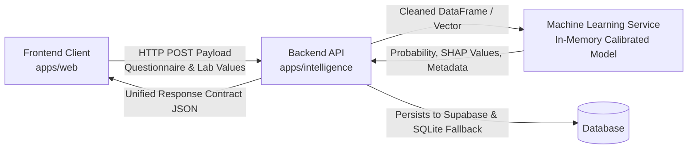

# BioPulse AI — Risk Assessment Interface Contract

This document formalizes the architectural boundary and JSON data contract between **Machine Learning**, the **Django Backend API**, and the **React Web / Mobile Frontends**.

---

## 1. Flow of Information



---

## 2. API Contract Specification

### Active Assessment Endpoint
- **URL**: `/api/v1/intelligence/assessment/active/`
- **Method**: `GET`
- **Description**: Returns the active (most recently submitted) assessment and clinical state for the authenticated user.

### Tier 1 Submission Endpoint
- **URL**: `/api/v1/intelligence/assessment/tier1/` (Female PCOS) / `/api/v1/intelligence/assessment/male/tier1/` (Male Hypogonadism)
- **Method**: `POST`
- **Payload**: User questionnaire inputs and baseline physical metrics.

### Tier 2 Submission Endpoint
- **URL**: `/api/v1/intelligence/assessment/tier2/` (Female PCOS) / `/api/v1/intelligence/assessment/male/tier2/` (Male Hypogonadism)
- **Method**: `POST`
- **Payload**: Laboratory test results, hormone panels, and metabolic biomarkers.

---

## 3. Standard Risk Assessment Output Contract (JSON)

Every successful assessment response conform to this schema:

```json
{
  "status": "success",
  "data": {
    "assessment_id": "c7a8b654-e022-482a-928d-19430dbdf7c5",
    "user_id": "user-uuid-string",
    "module": "female_pcos",
    "tier_level": "tier_1",
    "risk_score": 0.38,
    "risk_level": "moderate",
    "confidence": 0.89,
    "factors": [
      {
        "feature_name": "cycle_regularity",
        "display_name": "Menstrual Cycle Regularity",
        "observed_value": "irregular",
        "impact_direction": "elevates_risk"
      },
      {
        "feature_name": "bmi",
        "display_name": "Body Mass Index",
        "observed_value": 27.4,
        "impact_direction": "elevates_risk"
      },
      {
        "feature_name": "regular_exercise",
        "display_name": "Physical Activity",
        "observed_value": "yes",
        "impact_direction": "lowers_risk"
      }
    ],
    "explanation": [
      {
        "rank": 1,
        "feature": "cycle_regularity",
        "shap_value": 0.142,
        "summary": "Irregular cycle interval reported in baseline intake."
      },
      {
        "rank": 2,
        "feature": "bmi",
        "shap_value": 0.088,
        "summary": "Elevated BMI above standard non-risk baseline."
      }
    ],
    "model_metadata": {
      "model_version": "pcos-t1-calibrated-v1.2",
      "algorithm": "ExtraTreesClassifier + PlattSigmoid",
      "features_evaluated": 16,
      "generated_at": "2026-09-24T14:30:00Z"
    },
    "recommendations": [
      "Consult with your primary care provider or specialist for clinical validation.",
      "Consider completing Tier 2 biomarker evaluation to include hormone panel data."
    ]
  }
}
```

---

## 4. Architectural Separation of Concerns

1. **Machine Learning (`machine-learning/`)**:
   - Computes statistical probabilities (`0.0 <= risk_score <= 1.0`).
   - Calculates fold-averaged SHAP attributions for feature explainability.
   - Does **NOT** formulate medical diagnoses or hardcoded UI strings.
2. **Backend (`backend/apps/intelligence/`)**:
   - Validates input formats and sanitizes request bodies.
   - Maps continuous risk probabilities to contract buckets (`low`, `moderate`, `elevated`, `high`).
   - Persists assessment history and clinical state transitions.
   - Enforces authentication and patient data isolation.
3. **Frontend (`apps/web/` & `apps/mobile/`)**:
   - Renders intuitive visualization widgets (gauges, radar charts, SHAP breakdown bars).
   - Presents clear health context and next-step actions to patients and providers.
   - Prominently displays non-diagnostic medical disclaimers on all assessment screens.
