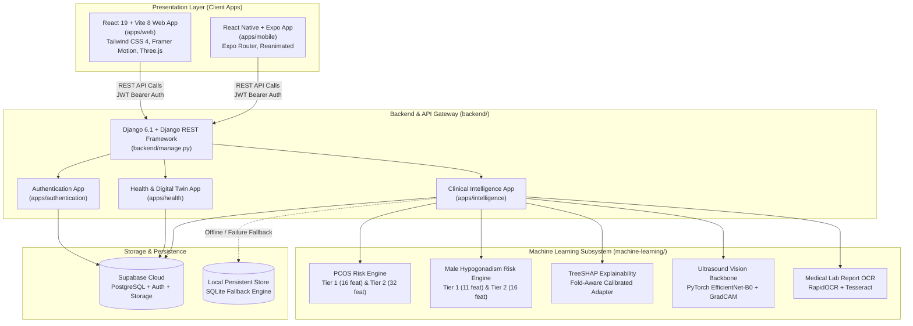

# BioPulse AI — System Architecture

This document describes the high-level system architecture of the **BioPulse AI Risk Assessment Platform**, illustrating how the presentation layer, API service, machine learning inference engines, and persistent cloud databases interact.

---

## 1. High-Level System Architecture

---

## 2. Key Subsystem Highlights

### A. Presentation Layer (`apps/web` & `apps/mobile`)
- Built with React 19, TypeScript, and modern component systems.
- Implements interactive risk dashboards, 3D anatomical models (Three.js/Fiber), dynamic radar charts, and downloadable clinical PDF reports.
- Handles responsive UX across desktop, tablet, and mobile breakpoints.

### B. API Layer (`backend/`)
- Powered by Django 6.1 and Django REST Framework.
- Enforces strict role-based access control, user isolation, and structured clinical state machine transitions.
- Automatic SQLite fallback (`ALLOW_LOCAL_SQLITE_FALLBACK`) guarantees resilient local development and offline CI test execution.

### C. Machine Learning Engine (`machine-learning/`)
- Dual-tier progressive risk pipelines for female reproductive health (PCOS) and male endocrine health (Hypogonadism).
- TreeSHAP and LinearSHAP explainers ensure every predicted probability is accompanied by human-interpretable feature contribution weights.
- Multi-modal vision integration enables analysis of pelvic ultrasound scans with Grad-CAM visual heatmaps.

### D. Persistence Layer
- Production: Supabase managed PostgreSQL, Row-Level Security (RLS), and secure storage buckets.
- Testing / Development: Self-contained SQLite test database ensuring completely isolated automated CI validation.
