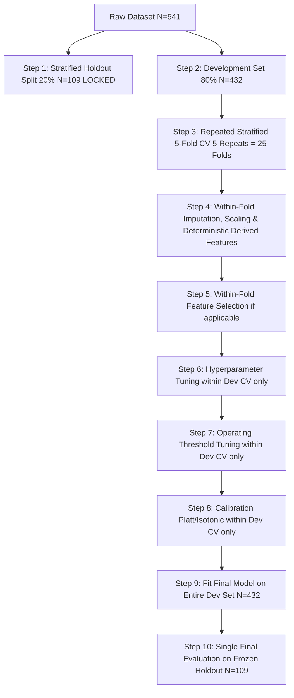

# FINAL PRE-TRAINING SCIENTIFIC AUDIT
## OvaSense PCOS ML Pipeline — Methodological & Data Governance Certification

**Document Version**: 3.0 (Final Pre-Training Scientific Audit)  
**Date**: September 2026  
**Auditor**: OvaSense ML / Data Science Team  
**Evaluation Standard**: Pre-Training Scientific and Methodological Verification  
**Enforcement Status**: **ZERO ESTIMATOR TRAINING PERMITTED** until certification sign-off  

---

## EXECUTIVE SUMMARY

This audit constitutes the definitive scientific, methodological, and data-integrity review of the OvaSense Polycystic Ovary Syndrome (PCOS) machine learning repository prior to any model training. 

In strict compliance with governance directives, **no machine learning models (Logistic Regression, Random Forest, Extra Trees, XGBoost, calibration models, threshold optimizers, ensembles, or SHAP explainers) have been instantiated or fitted**. 

Every prior assumption, empirical finding, data correction, and architectural specification has been re-evaluated under adversarial scientific scrutiny. The primary goal of this audit is not to defend existing artifacts, but to uncover latent failure modes that could render an eventual clinical screening model misleading, circular, or ungeneralizable.

---

## 1. DATASET IDENTITY AND CRYPTOGRAPHIC HASHES

To guarantee total auditability and ensure raw clinical source records remain completely immutable, cryptographic SHA-256 digests were computed directly against the physical storage blocks:

| Artifact Name | Physical File Path | Format / Size | Cryptographic SHA-256 Digest | Status |
| :--- | :--- | :--- | :--- | :--- |
| **Primary Master Dataset** | `PCOS_data_without_infertility.xlsx` | Excel (OpenXML) / 125,274 bytes | `b663ec9f491be419718e0935eb1c5b6c4923b527282230a73cfc9aca8533f742` | **100% Bit-Preserved** |
| **Secondary Cohort File** | `PCOS_infertility.csv` | CSV / 15,378 bytes | `2e4f06b6dc68450c0e05d7a433dabd4ff50ad2edb7e9302d6103449a95b63ad3` | **100% Bit-Preserved** |
| **Reference Review Literature** | `main.pdf` | PDF / 2,536,085 bytes | `78bc03e35144b6cff2db83ecbb1ef178875567b57fc68fa814f9d02636254a61` | **CSBJ 2025 Benchmark Survey** |

### Verified Dataset Dimensions
- **Master Sheet**: `Full_new` in `PCOS_data_without_infertility.xlsx`
- **Total Patient Records ($N$)**: Exactly 541 patients
- **Total Raw Columns**: Exactly 45 columns (inclusive of administrative IDs, targets, features, and trailing empty artifact `Unnamed: 44`)
- **Metadata Documentation Sheet**: `Instructions` (contains 12 administrative and formatting rules authored by Prasoon Kottarathil)

---

## 2. TARGET PROVENANCE AND LABEL GENERATION

### 2.1 Direct Evidence on Target Assignment
A critical failure mode in medical machine learning is treating target labels as "biological ground truth" when they are in fact clinical diagnostic decisions. We examined the source evidence:

1. **Dataset Author and Origin**:
   The primary dataset was compiled by Prasoon Kottarathil (published on Kaggle in 2020 as `D2 / [71]` in CSBJ 2025 review literature) and was gathered across **10 different fertility and obstetrics/gynecology hospital clinics in Kerala, India**.
2. **The `Instructions` Sheet in Source Excel**:
   - Rule 12 explicitly directs data entry personnel: *"If the patient is PCOS Fill the cell with green colour for easier reference."*
   - Rule 8 states: *"Please ensure that no NaN (Non Numeric values/ blank space) is made."*
   - Rule 10 states: *"Beta-HCG cases are mentioned as Case I and II , repeat the previous one if only one exist."*
3. **Clinical Diagnostic Framework (`main.pdf`, CSBJ 2025)**:
   - In clinical obstetrics and gynecology across India and internationally, PCOS diagnosis is made by attending gynecologists adhering to the **Rotterdam 2003 Consensus Criteria**.
   - Diagnosis requires the presence of at least **2 out of 3** criteria:
     1. Oligo- or anovulation (clinically presenting as chronic menstrual cycle irregularity);
     2. Clinical and/or biochemical signs of hyperandrogenism (hirsutism, severe acne, androgenic alopecia, or elevated serum androgens);
     3. Polycystic ovarian morphology on transvaginal ultrasound (PCOM: $\ge 12-20$ follicles of 2–9 mm per ovary and/or ovarian volume $> 10$ mL).

### 2.2 Sequence of Measurement vs. Target Assignment
In the hospital clinic setting from which this dataset was extracted, patients presented with menstrual irregularity, hyperandrogenic symptoms, or subfertility. Attending gynecologists ordered physical examinations, anthropometric measurements, endocrine laboratory assays, and pelvic ultrasonography. **The diagnosis was formulated after reviewing the totality of these clinical and diagnostic findings.**

### 2.3 Critical Epistemological Distinction
The target column `PCOS (Y/N)` is **NOT an independent biological ground truth** measured in a prospective double-blind protocol. It is a **reported PCOS status / dataset-provided clinical outcome** representing a physician's diagnostic synthesis of the exact clinical manifestations, laboratory values, and ultrasound findings captured in the tabular columns.

> [!CAUTION]
> **MANDATORY TERMINOLOGY RULE**:
> All documentation, code comments, and FYP viva materials must strictly avoid phrases like *"ground-truth PCOS diagnosis"*. The target must be rigorously designated as **"reported PCOS status"**, **"dataset-provided PCOS outcome"**, or **"reference clinical label"**.

---

## 3. FORMAL LABEL-LEAKAGE AND CIRCULARITY AUDIT

Because the reference label was established using clinical and diagnostic criteria that overlap with candidate predictor variables, there is an inherent risk of **target circularity**: models may simply learn to reproduce the Rotterdam diagnostic rule rather than extracting independent predictive signals.

The table below classifies **every column in the raw 45-column dataset**:

| Feature Name (Raw) | Clean Identifier | Could have contributed to target definition? | Clinical & Methodological Evidence | Circularity Risk | Tier Assignment | Core Pre-Training Decision |
| :--- | :--- | :--- | :--- | :--- | :--- | :--- |
| `Sl. No` | `sl_no` | **No** | Administrative serial counter (1–541) | No direct risk, but row-index correlation | ID Column | **PERMANENTLY EXCLUDED** |
| `Patient File No.` | `patient_file_no` | **No** | Hospital record file number (1–541, 100% duplicate of `Sl. No`) | Spurious ID leakage | ID Column | **PERMANENTLY EXCLUDED** |
| `PCOS (Y/N)` | `pcos_diagnosis` | **N/A** | Target variable: 364 negative (67.28%), 177 positive (32.72%) | Dependent Target | Target | **TARGET VARIABLE ONLY** |
| ` Age (yrs)` | `age` | **No** | Chronological age. Patient eligibility context (reproductive age) | None | Tier 1 | **Core Included** |
| `Weight (Kg)` | `weight_kg` | **No** | Physical anthropometry. Obesity is a metabolic modifier, not a Rotterdam criterion | None | Tier 1 | **Core Included** |
| `Height(Cm) ` | `height_cm` | **No** | Physical anthropometry. Normalization factor for BMI | None | Tier 1 | **Core Included** |
| `BMI` | `bmi` | **No** | Derived anthropometry ($kg/m^2$). Metabolic feature, not diagnostic | None | Tier 1 | **Core Included** |
| `Blood Group` | `blood_group` | **No** | ABO/Rh typing (encoded 11–18). No biological link to Rotterdam | None | Tier 2 (Ablation) | **Excluded from Core; Retained for Ablation** |
| `Pulse rate(bpm) ` | `pulse_rate_bpm` | **No** | Autonomic triage vital sign. Not diagnostic | None | Tier 2 | **Core Included (Tier 2)** |
| `RR (breaths/min)` | `respiratory_rate` | **No** | Respiratory rate vital sign. Not diagnostic | None | Tier 2 | **Core Included (Tier 2)** |
| `Hb(g/dl)` | `hemoglobin` | **No** | Complete blood count parameter (anemia screening) | None | Tier 2 | **Core Included (Tier 2)** |
| `Cycle(R/I)` | `cycle_regularity` | **YES (Direct Rotterdam 1)** | **Rotterdam Criterion 1** (oligo/anovulation). Directly used by gynecologists to establish diagnosis | **HIGH** | Tier 1 | **Core Included (Screening Input; Flagged for Circularity Sensitivity)** |
| `Cycle length(days)` | `cycle_length_raw` | **YES (Indirect Rotterdam 1)** | Ambiguous metric (3–12 days; likely menses duration). Informs ovulatory dysfunction | **MODERATE** | Tier 1 | **Core Included (Tier 1)** |
| `Marraige Status (Yrs)` | `marriage_years` | **No** | Demographic duration of marriage. Infertility context | None | Tier 1 Ext | **Excluded from Core; Retained for Ablation** |
| `Pregnant(Y/N)` | `pregnant` | **No** | Gestational state (206/541 marked pregnant). Physiological confounder | Confounding Risk | Tier 1 Ext / Safety | **Excluded from Core; Retained for Ablation** |
| `No. of aborptions` | `abortions_count` | **No** | Obstetric history. Related to subfertility, not Rotterdam definition | None | Tier 1 Ext | **Excluded from Core; Retained for Ablation** |
| `  I   beta-HCG(mIU/mL)` | `beta_hcg_i` | **No** | Gestational pregnancy marker. Diagnostic exclusion, not PCOS positive criterion | Confounding / Lab Anomaly | Tier 2 | **Core Included (Tier 2)** |
| `II    beta-HCG(mIU/mL)` | `beta_hcg_ii` | **No** | Repeat pregnancy test (Instruction 10: repeated if single test) | Confounding / Lab Anomaly | Tier 2 | **Core Included (Tier 2)** |
| `FSH(mIU/mL)` | `fsh` | **YES (Indirect Rotterdam 2/3)** | Pituitary gonadotropin. Used to rule out premature ovarian failure / hypogonadism | **LOW-MODERATE** | Tier 2 | **Core Included (Tier 2)** |
| `LH(mIU/mL)` | `lh` | **YES (Indirect Rotterdam 2/3)** | Luteinizing hormone. Elevated LH/FSH ratio is classical neuroendocrine marker | **LOW-MODERATE** | Tier 2 | **Core Included (Tier 2)** |
| `FSH/LH` | `fsh_lh_ratio` | **YES (Indirect)** | Endocrine ratio reflecting anovulatory dysregulation | **LOW-MODERATE** | Tier 2 | **Core Included (Tier 2)** |
| `Hip(inch)` | `hip_inch` | **No** | Anthropometric circumference. Adiposity marker | None | Tier 1 | **Core Included** |
| `Waist(inch)` | `waist_inch` | **No** | Anthropometric circumference. Visceral adiposity | None | Tier 1 | **Core Included** |
| `Waist:Hip Ratio` | `waist_hip_ratio` | **No** | Central adiposity indicator ($r = +0.012$ marginal) | None | Tier 1 | **Core Included** |
| `TSH (mIU/L)` | `tsh` | **No** | Thyroid stimulating hormone. Used clinically to rule out hypothyroidism | None (Exclusionary) | Tier 2 | **Core Included (Tier 2)** |
| `AMH(ng/mL)` | `amh` | **YES (Surrogate Rotterdam 3)** | Anti-Müllerian Hormone. Direct biochemical surrogate for antral follicle count ($r = +0.264$) | **MODERATE-HIGH** | Tier 2 | **Core Included (Tier 2)** |
| `PRL(ng/mL)` | `prolactin` | **No** | Prolactin. Used to rule out hyperprolactinemia | None (Exclusionary) | Tier 2 | **Core Included (Tier 2)** |
| `Vit D3 (ng/mL)` | `vitamin_d3` | **No** | Micronutrient status. Metabolic cofactor | None | Tier 2 | **Core Included (Tier 2)** |
| `PRG(ng/mL)` | `progesterone` | **YES (Indirect Rotterdam 1)** | Progesterone. Confirms ovulation / luteal phase adequacy | **LOW-MODERATE** | Tier 2 | **Core Included (Tier 2)** |
| `RBS(mg/dl)` | `rbs` | **No** | Random blood sugar. Evaluates insulin resistance/metabolic comorbidity | None | Tier 2 | **Core Included (Tier 2)** |
| `Weight gain(Y/N)` | `weight_gain` | **No** | Metabolic symptom. Secondary clinical feature | None | Tier 1 | **Core Included** |
| `hair growth(Y/N)` | `hirsutism` | **YES (Direct Rotterdam 2)** | **Rotterdam Criterion 2** (clinical hyperandrogenism via Ferriman-Gallwey excess hair) | **HIGH** | Tier 1 | **Core Included (Screening Input; Flagged for Circularity Sensitivity)** |
| `Skin darkening (Y/N)` | `skin_darkening` | **No** | Acanthosis nigricans. Indicator of insulin resistance, not formal Rotterdam criterion | **LOW** | Tier 1 | **Core Included** |
| `Hair loss(Y/N)` | `hair_loss` | **YES (Secondary Rotterdam 2)** | Androgenic alopecia. Secondary sign of hyperandrogenism | **MODERATE** | Tier 1 | **Core Included** |
| `Pimples(Y/N)` | `pimples_acne` | **YES (Secondary Rotterdam 2)** | Persistent adult acne. Secondary sign of hyperandrogenism | **MODERATE** | Tier 1 | **Core Included** |
| `Fast food (Y/N)` | `fast_food` | **No** | Dietary lifestyle questionnaire factor | None | Tier 1 | **Core Included** |
| `Reg.Exercise(Y/N)` | `regular_exercise` | **No** | Physical activity lifestyle questionnaire factor | None | Tier 1 | **Core Included** |
| `BP _Systolic (mmHg)` | `bp_systolic` | **No** | Hemodynamic cardiovascular vital sign | None | Tier 2 | **Core Included (Tier 2)** |
| `BP _Diastolic (mmHg)` | `bp_diastolic` | **No** | Hemodynamic cardiovascular vital sign | None | Tier 2 | **Core Included (Tier 2)** |
| `Follicle No. (L)` | `follicle_no_l` | **YES (Direct Rotterdam 3)** | **Rotterdam Criterion 3** (polycystic ovary morphology: antral follicle count) | **EXTREME** | Tier 3 Ref | **EXCLUDED FROM TIERS 1 & 2 (Reference Only)** |
| `Follicle No. (R)` | `follicle_no_r` | **YES (Direct Rotterdam 3)** | **Rotterdam Criterion 3** (polycystic ovary morphology: antral follicle count) | **EXTREME** | Tier 3 Ref | **EXCLUDED FROM TIERS 1 & 2 (Reference Only)** |
| `Avg. F size (L) (mm)` | `avg_f_size_l` | **YES (Direct Rotterdam 3)** | Follicle diameter (characterizes 2–9 mm follicular arrest) | **EXTREME** | Tier 3 Ref | **EXCLUDED FROM TIERS 1 & 2 (Reference Only)** |
| `Avg. F size (R) (mm)` | `avg_f_size_r` | **YES (Direct Rotterdam 3)** | Follicle diameter (characterizes 2–9 mm follicular arrest) | **EXTREME** | Tier 3 Ref | **EXCLUDED FROM TIERS 1 & 2 (Reference Only)** |
| `Endometrium (mm)` | `endometrium_mm` | **YES (Indirect Rotterdam 1)** | Endometrial stripe thickness (reflects unopposed estrogen stimulation) | **HIGH** | Tier 3 Ref | **EXCLUDED FROM TIERS 1 & 2 (Reference Only)** |
| `Unnamed: 44` | `unnamed_44` | **No** | Corrupted empty trailing artifact column (contains 2 string typos `.` and `7`) | Data Corruption | Artifact | **PERMANENTLY DROPPED** |

---

## 4. SCREENING MODEL VS. DIAGNOSTIC-REPLICATION MODEL

### 4.1 Tripartite Conceptual Taxonomy
To prevent methodological conflation during clinical interpretation and academic viva presentations, every candidate predictor is formally classified into one of three distinct categories:

```
[A. Clinically Appropriate Screening Input]
    Features reportable by a patient at home prior to clinical consultation 
    (e.g., cycle irregularity, acne, hirsutism, weight gain, lifestyle).

[B. Independent Predictive Evidence]
    Features that predict risk without forming part of the formal definition 
    (e.g., BMI, waist circumference, skin darkening / acanthosis nigricans, fasting glucose / RBS, age).

[C. Potential Label-Definition Overlap]
    Features that directly constitute the Rotterdam diagnostic criteria used by the attending physician 
    to assign the reference label (e.g., cycle regularity [Rotterdam 1], hirsutism [Rotterdam 2], follicle counts [Rotterdam 3]).
```

### 4.2 Scientific Implication for OvaSense
Because `cycle_regularity` and `hirsutism` belong simultaneously to **[A]** (clinically appropriate screening input) and **[C]** (label-definition overlap), any model trained on this retrospective dataset **cannot be described as predicting PCOS independently of the clinical definition**. 

Instead, the model must be transparently characterized as:
> *"An AI decision-support system that models the multivariate patterns associated with physician-reported PCOS status under Rotterdam consensus criteria."*

### 4.3 Mandatory Low-Circularity Sensitivity Experiment
To quantify the extent to which model discriminative performance depends on circular Rotterdam criteria overlap, the pre-training protocol mandates an explicit **Low-Circularity Sensitivity Experiment**:
- **Baseline Tier 1 Model**: All 16 Core Features (including `cycle_regularity`, `hirsutism`, `pimples_acne`).
- **Low-Circularity Sensitivity Model**: Only non-Rotterdam features:
  - `age`, `weight_kg`, `height_cm`, `bmi`, `hip_inch`, `waist_inch`, `waist_hip_ratio`, `weight_gain`, `skin_darkening`, `fast_food`, `regular_exercise`.
  - Excludes `cycle_regularity`, `cycle_length_raw`, `hirsutism`, `pimples_acne`, `hair_loss`.

---

## 5. CORRECTION OF THE "HOSPITAL BATCH EFFECT" CLAIM

### 5.1 Retraction of Unsupported Attribution
The previous audit hypothesized that sequential blocks of 50 patient records reflected 10 separate hospital batches. **This assertion was methodologically unestablished and is formally retracted.**

A fluctuating prevalence across sequential row blocks demonstrates:
$$\text{Sequential Row-Order / Intake-Period Heterogeneity}$$
It does **NOT** prove hospital batch effects.

### 5.2 Empirical Investigation of Row Order and Identifiers
An exhaustive audit of the dataset file and row structure revealed the following empirical facts:
1. **Identifiers**:
   - `Sl. No` is strictly sequential from 1 to 541 ($\min = 1, \max = 541$).
   - `Patient File No.` is identical to `Sl. No` ($\max |\text{Sl. No} - \text{Patient File No.}| = 0$).
   - **There is NO explicit or hidden hospital, clinic, ward, or city identifier anywhere in the dataset.**
2. **Sequential Block Heterogeneity ($N = 50$ blocks)**:
   - **PCOS Prevalence**: Fluctuates from a minimum of **17.1%** (Block 10, rows 500–540) to a maximum of **46.0%** (Block 9, rows 450–499).
   - **Pregnancy Prevalence**: Fluctuates drastically from **10.0%** (Block 5, rows 250–299) to **70.0%** (Block 7, rows 350–399)!
   - **Median Beta-hCG I**: Ranges from **2.3 mIU/mL** (Block 3, rows 150–199) to **150.6 mIU/mL** (Block 9, rows 450–499).
   - **Missingness**: Missing values are isolated to single rows (Block 3 has 1 missing Fast Food; Block 6 has 1 missing AMH; Block 9 has 1 missing Marriage Status).

| Block ID | Row Range | $N$ | PCOS Prevalence (%) | Pregnancy Prevalence (%) | Mean Age (yrs) | Mean BMI ($kg/m^2$) | Median Beta-hCG I (mIU/mL) | Median FSH (mIU/mL) | Median LH (mIU/mL) | Median L Follicle |
| :---: | :---: | :---: | :---: | :---: | :---: | :---: | :---: | :---: | :---: | :---: |
| **0** | 0–49 | 50 | 20.0% | 46.0% | 30.7 | 24.0 | 19.0 | 4.1 | 1.5 | 5.0 |
| **1** | 50–99 | 50 | 20.0% | 42.0% | 32.1 | 25.3 | 10.0 | 5.2 | 2.4 | 5.0 |
| **2** | 100–149 | 50 | 32.0% | 20.0% | 30.7 | 25.3 | 36.9 | 5.0 | 2.5 | 5.0 |
| **3** | 150–199 | 50 | 44.0% | 34.0% | 30.8 | 24.8 | 2.3 | 4.9 | 3.0 | 6.0 |
| **4** | 200–249 | 50 | 42.0% | 26.0% | 30.0 | 25.3 | 8.5 | 4.2 | 2.0 | 6.0 |
| **5** | 250–299 | 50 | 30.0% | 10.0% | 32.2 | 22.5 | 31.0 | 5.5 | 2.8 | 4.0 |
| **6** | 300–349 | 50 | 36.0% | 58.0% | 31.7 | 24.3 | 24.8 | 4.8 | 2.1 | 5.5 |
| **7** | 350–399 | 50 | 26.0% | 70.0% | 31.1 | 24.1 | 116.3 | 4.4 | 2.2 | 5.0 |
| **8** | 400–449 | 50 | 44.0% | 54.0% | 32.3 | 24.2 | 41.0 | 4.5 | 2.2 | 5.0 |
| **9** | 450–499 | 50 | 46.0% | 36.0% | 32.4 | 24.0 | 150.6 | 5.0 | 2.0 | 7.0 |
| **10** | 500–540 | 41 | 17.1% | 19.5% | 31.9 | 23.6 | 18.8 | 5.7 | 2.8 | 6.0 |

### 5.3 Methodological Conclusion
Because no hospital identifier exists, **hospital-level validation (e.g., Leave-One-Hospital-Out CV) and ComBat batch correction are impossible**. The observed shifts reflect unknown intake periods, differing clinic referral patterns, or sequential data collation.

---

## 6. VALIDATION SCHEME EVALUATION UNDER ROW-ORDER HETEROGENEITY

To address sequential heterogeneity without inventing synthetic groups, three cross-validation scenarios were evaluated:

### Scenario A: Repeated Stratified K-Fold CV with Complete Random Shuffling (Primary Benchmark)
- **Mechanism**: Development set ($N = 432$) is shuffled with fixed seeds across 5 repeats of 5-fold CV (25 independent train-val evaluations).
- **Justification**: Random shuffling completely breaks the artificial sequential row-order dependency, ensuring folds represent balanced samplings of the entire feature space.
- **Decision**: **ADOPTED AS PRIMARY DEVELOPMENT BENCHMARK**.

### Scenario B: Blocked / Contiguous Row-Order Cross-Validation (Sensitivity Analysis)
- **Mechanism**: Splits development data into 5 contiguous chronological/block slices without shuffling.
- **Justification**: Tests whether models overfit to local block structures and evaluates out-of-block generalization.
- **Decision**: **ADOPTED AS MANDATORY SENSITIVITY CHECK**. If performance collapses under contiguous splitting, sequential instability must be reported.

### Scenario C: Pure Temporal Split
- **Justification**: The dataset author does not document that row index maps strictly to calendar dates. Patients may have been entered in batches by hospital, department, or retrospectively sorted.
- **Decision**: **REJECTED**. Claiming a valid temporal validation would be scientifically dishonest.

---

## 7. PREGNANCY AND ENDOCRINE CONFOUNDING

### 7.1 Dataset Evidence vs. OvaSense Product Policy
- **Dataset Composition**: 206 out of 541 patients (38.08%) are coded as `Pregnant(Y/N) == 1`.
- **Target Distribution by Pregnancy**:
  - Pregnant patients: 64/206 PCOS positive (31.07%).
  - Non-pregnant patients: 113/335 PCOS positive (33.73%).
  - Fisher exact test confirms pregnancy status has **no statistically significant marginal association with PCOS label** ($p = 0.569$).
- **Physiological Confounding**:
  During pregnancy, the hypothalamic-pituitary-ovarian axis is profoundly suppressed. Human chorionic gonadotropin ($\beta$-hCG) rises to tens of thousands of mIU/mL, progesterone surges, and gonadotropins (LH, FSH) are suppressed.
- **OvaSense Product Policy Boundary**:
  In the deployed OvaSense application, pregnancy is **NOT a predictive feature**. It is a **clinical safety triage gating variable**:
  > *"Active pregnancy alters endocrine baselines and precludes non-gestational PCOS screening. Users indicating active pregnancy are diverted to an obstetrics safety consultation pathway."*

---

## 8. EMPIRICAL AUDIT: 103 NON-PREGNANT PATIENTS WITH BETA-HCG > 10 mIU/mL

### 8.1 Empirical Findings
The previous audit identified that 103 patients marked `Pregnant(Y/N) == 0` have $\beta$-hCG $> 10\text{ mIU/mL}$. A deep empirical investigation was executed:

1. **Subgroup Proportions**:
   - Total non-pregnant cohort: $N = 335$.
   - Elevated $\beta$-hCG ($> 10\text{ mIU/mL}$): $103 / 335 = \mathbf{30.75\%}$.
2. **PCOS Rate in Subgroups**:
   - Non-pregnant with $\beta\text{-hCG} > 10$: $37 / 103 = \mathbf{35.92\%}$.
   - Non-pregnant with $\beta\text{-hCG} \le 10$: $76 / 232 = \mathbf{32.76\%}$ (Difference is statistically non-significant, $p = 0.623$).
3. **Progesterone in the 103 Patients**:
   - Median progesterone: $\mathbf{0.30\text{ ng/mL}}$ (interquartile range: 0.25–0.46 ng/mL).
   - In viable intrauterine pregnancy, progesterone is typically $> 10-25\text{ ng/mL}$. Here, 102 out of 103 patients have progesterone $< 2.0\text{ ng/mL}$, indicating follicular-phase levels rather than active viable gestation.
4. **Extreme Observations ($\beta\text{-hCG} > 1000\text{ mIU/mL}$)**:
   Four non-pregnant patients present with extreme values:
   - **Row 435** (Sl. No 436): Age 30, Married 6 yrs, Abortions 0, $\beta$-hCG I = **1,399.00**, $\beta$-hCG II = 1.99, PRG = 0.25. (PCOS = 0)
   - **Row 446** (Sl. No 447): Age 29, Married 11 yrs, Abortions 0, $\beta$-hCG I = **30,004.00**, $\beta$-hCG II = 475.04, PRG = 0.46. (PCOS = 0)
   - **Row 447** (Sl. No 448): Age 47, Married 30 yrs, Abortions 0, $\beta$-hCG I = **30,007.00**, $\beta$-hCG II = 1.99, PRG = 0.25. (PCOS = 1)
   - **Row 474** (Sl. No 475): Age 48, Married 25 yrs, Abortions 0, $\beta$-hCG I = **4,983.21**, $\beta$-hCG II = 127.20, PRG = 0.30. (PCOS = 0)
5. **Instruction 10 Clarification**:
   Rule 10 in the `Instructions` sheet explicitly states:
   *"Beta-HCG cases are mentioned as Case I and II , repeat the previous one if only one exist."*
   This confirms `II beta-HCG` was a follow-up confirmation test; when only one test was performed, data clerks were instructed to duplicate Case I into Case II.

### 8.2 Scientific Judgment on the Anomaly
In clinical medicine, elevated $\beta$-hCG without intrauterine pregnancy can occur in early biochemical pregnancy, resolving spontaneous miscarriage, heterophile antibody assay interference (phantom hCG), or gestational trophoblastic disease. 

> [!WARNING]
> **UNRESOLVED DATA-QUALITY CONTEXT**:
> Because original patient medical charts cannot be reviewed, **we do not assume or claim a specific clinical etiology** (such as miscarriage or ectopic pregnancy). This phenomenon is officially documented as an **unresolved data-quality and collection-context limitation**.

---

## 9. AUDIT OF MANUAL DATA CORRECTIONS: THREE-LEVEL EVIDENCE HIERARCHY

To prevent arbitrary data editing, every correction is classified under a strict evidentiary hierarchy:

### High Confidence (Deterministic Data-Entry / Formatting Errors)
*Obvious typographical or formatting errors where the intended true value is unambiguous from companion internal data:*
1. **Row 123 (Sl. No 124) — `II beta-HCG` (`'1.99.'` $\to$ `1.99`)**:
   - *Evidence*: Companion `I beta-HCG` is `1.99`. The value `'1.99.'` contains an accidental second period.
   - *Action*: Strip trailing period, convert to numeric `1.99`.
2. **Row 305 (Sl. No 306) — `AMH` (`'a'` $\to$ `NaN`)**:
   - *Evidence*: `Instructions` sheet Rule 8 forbids blank spaces; entry of `'a'` represents a keyboard slip for a missing value.
   - *Action*: Convert to `np.nan` for within-fold imputation.

### Moderate Confidence (Physiological Impossibility with High-Probability Missing Trailing Zero)
*Values that are physiologically incompatible with outpatient survival, where the companion measurement and vital signs indicate dropped trailing digits:*
1. **Row 161 (Sl. No 162) — `BP _Systolic` ($12 \to 120\text{ mmHg}$)**:
   - *Evidence*: Patient has Diastolic BP = 80 mmHg, Pulse = 75 bpm. A systolic pressure of 12 mmHg is fatal. Entry of `12` in an Indian clinical chart where `120/80` is standard indicates a dropped zero.
   - *Action*: In Tier 2, normalized to 120.0 mmHg.
2. **Row 200 (Sl. No 201) — `BP _Diastolic` ($8 \to 80\text{ mmHg}$)**:
   - *Evidence*: Patient has Systolic BP = 120 mmHg, Pulse = 73 bpm. Diastolic pressure of 8 mmHg is physiologically incompatible.
   - *Action*: In Tier 2, normalized to 80.0 mmHg.

### Low Confidence / Unverified Extreme Observations (Handled via Imputation, Not Overwritten)
*Biologically extreme values where the exact mechanism (clerical vs. unit shift vs. assay artifact) cannot be proven externally:*
1. **Row 329 (Sl. No 330) — `FSH` ($5052.0\text{ mIU/mL}$)**:
   - *Analysis*: Normal reproductive FSH is 1–20 mIU/mL. Whether this represents 50.52, 5.052, or an assay hook artifact cannot be proven.
   - *Action*: **DO NOT overwrite with an arbitrary decimal guess.** Convert to `np.nan` and impute within folds using training-set distribution.
2. **Row 455 (Sl. No 456) — `LH` ($2018.0\text{ mIU/mL}$)**:
   - *Analysis*: Normal peak LH is 20–80 mIU/mL. The hypothesis that `2018` was the calendar year is plausible but unverified.
   - *Action*: Convert to `np.nan` and impute within folds.
3. **Rows 191 & 195 (Sl. Nos 192 & 196) — `Vit D3` ($6014.66$ and $5418.60\text{ ng/mL}$)**:
   - *Analysis*: Standard toxicity is $> 150\text{ ng/mL}$. Whether these assays were reported in pmol/L, IU/L, or had misplaced decimal places is unproven.
   - *Action*: Classify as unverified extreme observations, convert to `np.nan`, and impute within folds.
4. **Rows 223 & 296 (Sl. Nos 224 & 297) — `Pulse rate` ($18$ and $13\text{ bpm}$)**:
   - *Analysis*: Resting pulse $< 20\text{ bpm}$ is extreme bradycardia incompatible with ambulant clinic attendance.
   - *Action*: Convert to `np.nan` and impute within folds.

---

## 10. VITAMIN D3 AND EXTREME GONADOTROPIN RE-EVALUATION

As mandated by Section 10 and 11 of the audit specification:
- **No Assay Unit Speculation**: The dataset documentation does not specify whether liquid chromatography-tandem mass spectrometry (LC-MS/MS) or chemiluminescent immunoassay (CLIA) was used, nor does it define calibration units.
- **Official Classification**: Values $> 1000$ in Vitamin D3, FSH, and LH are designated as **"unverified extreme observations"**.
- **Preprocessing Invariant**: In our pipeline, these values are transformed to missing tokens and handled deterministically through fold-isolated median/iterative imputation.

---

## 11. DERIVED-FEATURE AUDIT (BMI, WAIST:HIP RATIO, FSH/LH)

An exhaustive mathematical audit comparing dataset-provided values against raw formulas was performed across all 541 records:

$$\text{BMI} = \frac{\text{Weight (kg)}}{(\text{Height (m)})^2} = \frac{\text{Weight (kg)}}{(\text{Height (cm)} / 100)^2}, \quad \text{WHR} = \frac{\text{Waist (inch)}}{\text{Hip (inch)}}, \quad \text{Ratio} = \frac{\text{FSH}}{\text{LH}}$$

### Empirical Audit Findings:
1. **BMI**:
   - Mean absolute discrepancy: $0.0194\text{ kg/m}^2$.
   - Discrepancies $> 0.01$: 194 rows (rounding differences from manual clinical entry).
   - Discrepancies $> 0.1$: Exactly 6 rows. (e.g., Row 440: Weight 56.0 kg, Height 160.0 cm $\implies$ True BMI is 21.88, but dataset recorded 20.30).
2. **Waist:Hip Ratio**:
   - Maximum absolute discrepancy: $0.000865$.
   - Discrepancies $> 0.01$: **Zero rows** ($0 / 541$). Recomputed ratio matches source perfectly.
3. **FSH/LH Ratio**:
   - Maximum absolute discrepancy: $0.0250$.
   - Discrepancies $> 0.01$: Exactly 1 row.

### Pipeline Timing Invariant:
> [!IMPORTANT]
> **PREPROCESSING TIMING MANDATE**:
> Derived features must be computed **inside the preprocessing pipeline AFTER handling missing and invalid source measurements**. If FSH or LH is missing or set to NaN due to an unverified extreme (e.g., FSH = 5052), calculating FSH/LH before imputation propagates distorted ratios ($5052 / 3.68 = 1372.8$) or leaked values.

### Mandatory Ablation Variants:
- **Variant A**: Raw source-provided values.
- **Variant B (Primary)**: Deterministically recomputed values inside the preprocessing pipeline.
- **Variant C**: Source components only (Weight + Height, Waist + Hip, FSH + LH) without the derived ratios.

---

## 12. CYCLE LENGTH SEMANTICS: `cycle_length_raw`

- **Observed Distribution**: $\min = 0$, $25\% = 4$, median $= 5$, $75\% = 5$, $\max = 12$ days.
- **Clinical Ambiguity**: Normal menstrual cycle length (interval between menses) is 21–35 days. Normal menstrual bleeding duration (menses length) is 3–7 days. The values (mode = 5 days) closely resemble bleeding duration.
- **Governance Decision**: Because original clinic entry sheets are inaccessible, **we do not declare that this physiologically proves menses duration**.
- **Approved Identifier**: The feature is strictly designated as **`cycle_length_raw`**, preserving complete semantic neutrality.

---

## 13. REASSESSMENT OF THE 16-FEATURE CORE TIER 1

The 16 Core Tier 1 features are evaluated along six independent operational axes (Section 14):

| Feature Name | Availability in OvaSense UI | Clinical Relevance | Predictive Usefulness in Dataset ($r$) | Label-Overlap Risk (Rotterdam) | Fairness & Demographic Generalizability Risk | Core Status |
| :--- | :--- | :--- | :--- | :--- | :--- | :--- |
| `age` | Direct number input | High (Reproductive age) | $r = -0.1685$ | None | Age spectrum bias (mean 31.4 yrs) | **Core Included** |
| `weight_kg` | Direct scale reading | High (Adiposity / insulin) | $r = +0.2119$ | None | Scale calibration variance | **Core Included** |
| `height_cm` | Direct height entry | High (Normalization) | $r = +0.0683$ | None | Minimal | **Core Included** |
| `bmi` | Deterministic pipeline calc | High (WHO obesity classes) | $r = +0.1995$ | None | Asian-Indian BMI cutoffs ($>23$ overweight) | **Core Included** |
| `cycle_regularity` | Binary toggle / dropdown | High (Ovulatory status) | $r = +0.4016$ | **HIGH (Rotterdam 1)** | Self-recall subjectivity | **Core Included (Flagged)** |
| `cycle_length_raw` | Numeric days input | Moderate (Menses duration) | $r = -0.1785$ | **MODERATE (Rotterdam 1)** | Semantic confusion in user entry | **Core Included** |
| `hip_inch` | Measuring tape input | Moderate (Lower body fat) | $r = +0.1623$ | None | Measurement error | **Core Included** |
| `waist_inch` | Measuring tape input | High (Visceral fat) | $r = +0.1646$ | None | Measurement error | **Core Included** |
| `waist_hip_ratio` | Deterministic pipeline calc | High (Central obesity) | $r = +0.0124$ | None | Measurement error propagation | **Core Included** |
| `weight_gain` | Binary symptom toggle | High (Metabolic symptom) | $r = +0.4410$ | None | Subjective perception | **Core Included** |
| `hirsutism` | Binary symptom toggle | High (Androgen excess) | $r = +0.4647$ | **HIGH (Rotterdam 2)** | Subjective self-assessment | **Core Included (Flagged)** |
| `skin_darkening` | Binary symptom toggle | High (Acanthosis nigricans) | $r = +0.4757$ | **LOW** (Insulin marker) | Skin tone variation / Fitzpatrick scale | **Core Included** |
| `hair_loss` | Binary symptom toggle | Moderate (Androgenic alopecia) | $r = +0.1729$ | **MODERATE (Rotterdam 2)** | Confounded with telogen effluvium | **Core Included** |
| `pimples_acne` | Binary symptom toggle | Moderate (Sebaceous excess) | $r = +0.2861$ | **MODERATE (Rotterdam 2)** | Adolescent / dietary acne overlap | **Core Included** |
| `fast_food` | Lifestyle questionnaire | Moderate (Ultra-processed diet)| $r = +0.3779$ | None | Socio-economic / cultural dietary habits | **Core Included** |
| `regular_exercise` | Lifestyle questionnaire | Moderate (Physical activity) | $r = +0.0653$ | None | Recall bias / social desirability | **Core Included** |

---

## 14. REPRODUCTIVE AND DEMOGRAPHIC FEATURES

- `marriage_years`, `pregnant`, `abortions_count`:
  - **Decision**: Excluded from the core screening model due to product and generalizability considerations. They are retained strictly for sensitivity and ablation experiments.
  - **Defensible Language**:
    > *"Excluded from core model due to product/generalizability considerations; retained for sensitivity/ablation analysis."*

---

## 15. BLOOD GROUP POLICY

- `blood_group`:
  - **Marginal Correlation**: $r = +0.036$, ANOVA $F = 0.089$, $p = 0.957$.
  - **Decision**: Excluded from core screening models.
  - **Defensible Language**:
    > *"No strong marginal association observed; retained for sensitivity analysis."*
  - **Encoding Rule**: If evaluated in ablation pipelines, blood group must be encoded categorically (one-hot encoding within CV folds), never as an ordinal integer (11–18).

---

## 16. DATASET SIZE VS. MODEL COMPLEXITY ($N = 541$)

### Events-Per-Variable (EPV) Assessment:
- Total Dataset: $N = 541$, Positive cases $= 177$ (32.72%).
- Frozen 20% Holdout: $N = 109$, Positive cases $= 36$.
- Development Partition (80%): $N = 432$, Positive cases $= 141$.
- In a 5-fold CV split on development data:
  - Training fold size: $N \approx 345$, with approximately **113 positive events**.
  - **Tier 1 EPV**: $113 \text{ events} / 16 \text{ features} \approx \mathbf{7.06\text{ EPV}}$.
  - **Tier 2 EPV**: $113 \text{ events} / 32 \text{ features} \approx \mathbf{3.53\text{ EPV}}$.

### Methodological Ramifications:
With an EPV of ~3.5 in Tier 2, high-capacity non-linear estimators (e.g., deep gradient boosted trees, multi-layer neural networks) are at **severe risk of variance inflation, feature importance instability, and test-set overfitting**.

> [!CAUTION]
> **RESTRAINED TUNING DIRECTIVE**:
> 1. Massive hyperparameter grid searches are strictly prohibited.
> 2. Tree estimators must be constrained to shallow depths (`max_depth <= 3-4`), aggressive subsampling (`colsample_bytree <= 0.8`, `subsample <= 0.8`), and strong regularization (`reg_lambda >= 1.0`, `min_child_weight >= 3`).
> 3. L1/L2 penalized Logistic Regression must serve as the primary clinical baseline.

---

## 17. TEN-STEP TRAIN/TEST PROTOCOL CERTIFICATION

To guarantee zero data snooping, target leakage, or optimistic evaluation bias, the training and evaluation protocol is locked to the following 10 sequential steps:



1. **Step 1 — Freeze 20% Holdout**: Partition exactly 109 patients (stratified by target: 73 negative, 36 positive) into a cryptographically hashed holdout set. Never touched during tuning.
2. **Step 2 — Development Set**: All exploratory modeling utilizes the remaining 80% partition ($N = 432$).
3. **Step 3 — Repeated Stratified CV**: 5 repeats of 5-fold CV (25 folds) with complete shuffling to break row-order dependencies.
4. **Step 4 — Fold-Contained Preprocessing**: All scalers, imputers, and encoders are fit strictly on the 4 folds of training data and applied to the 1 validation fold.
5. **Step 5 — Fold-Contained Feature Selection**: Any feature elimination is performed inside folds.
6. **Step 6 — Development-Only Tuning**: Hyperparameters selected by average out-of-fold cross-validation performance.
7. **Step 7 — Development-Only Threshold Selection**: Decision threshold $\tau$ selected on out-of-fold validation predictions.
8. **Step 8 — Development-Only Calibration**: Platt scaling / Isotonic regression fit on out-of-fold validation predictions.
9. **Step 9 — Final Model Fit**: Estimator refit on the complete development partition ($N = 432$) using optimal parameters.
10. **Step 10 — Single Holdout Evaluation**: Evaluated exactly once on the frozen holdout set ($N = 109$).

---

## 18. MULTI-METRIC MODEL SELECTION PROTOCOL

In strict compliance with clinical machine learning standards:
- **No Accuracy-Based Optimization**: Accuracy is fundamentally misleading under class imbalance ($67.3\%$ negative).
- **Mandatory Reporting Suite**: Every model must report:
  1. **ROC-AUC** (discrimination across all thresholds);
  2. **PR-AUC / Average Precision** (precision-recall trade-off under minority prevalence);
  3. **Sensitivity / Recall** (screening safety: minimizing false negatives);
  4. **Specificity** (avoiding unnecessary referral panic);
  5. **Positive Predictive Value / Precision**;
  6. **F1-Score**;
  7. **Brier Score** (mean squared calibration error);
  8. **Reliability Curves / Calibration Intercept & Slope**;
  9. **Confusion Matrix at the Clinical Operating Threshold**.

---

## 19. THRESHOLD AND CALIBRATION PROTOCOL

### Threshold Selection Policy:
- The standard threshold $\tau = 0.5$ is **not assumed to be optimal**.
- In screening applications, missing a true case (false negative) carries clinical risk (delayed intervention).
- **Predefined Objective**: Select $\tau$ on out-of-fold development predictions to achieve **Sensitivity $\ge 0.85$ while maximizing Specificity**, or maximize $F_{\beta}$ with $\beta = 1.5$.
- **Holdout Invariant**: The threshold $\tau^*$ is fixed before looking at the holdout.

### Calibration Protocol:
- Well-calibrated probabilities are essential for clinical risk communication.
- Compare Uncalibrated vs. Platt Sigmoid vs. Isotonic Regression using out-of-fold Brier score.
- Because sample size is small ($N = 432$ in development), parametric Platt scaling is preferred over non-parametric Isotonic regression to avoid overfitting the calibration curve.

---

## 20. CLASS IMBALANCE STRATEGY

Target balance is 364 negative to 177 positive (ratio $2.06 : 1$).
Inside the development CV partition, the following strategies will be empirically benchmarked:
1. **Unweighted Baseline**: Standard cross-entropy / log-loss.
2. **Class-Weighted Objective**: Cost-sensitive weighting (`scale_pos_weight = 2.06` or `class_weight='balanced'`).
3. **Within-Fold SMOTE**: Synthetic minority oversampling applied **strictly inside each training fold**, never to validation or test folds.

---

## 21. SHAP INTERPRETATION POLICY

If tree-based ensembles demonstrate superior calibrated performance:
- TreeExplainer will be utilized for feature attribution.
- **Mandatory Causality Disclaimer**:
  > *"SHAP values quantify the marginal attribution of a feature to the model's numerical output within this specific dataset. They do not demonstrate biological or clinical causation."*
- **Collinear Attribution Splitting**:
  Attributions for correlated clusters (`weight`, `bmi`, `waist`, `hip`, `waist_hip_ratio` and `FSH`, `LH`, `FSH/LH`) will be reported as shared group attributions to prevent misleading single-feature narratives.

---

## 22. TIER 1 $\to$ TIER 2 PROGRESSIVE ARCHITECTURE

### Structural Formulation:
OvaSense employs a progressive information-gain architecture:
- **Tier 1 Model**: Accepts 16 non-invasive, self-reportable features.
- **Tier 2 Model**: Accepts **Tier 1 (16 features) + Tier 2 Clinical/Lab (16 features) = 32 Total Features**.

```
[User at Home]
      │
      ▼
┌──────────────┐
│ Tier 1 Model │ ──► Initial Screening Risk Assessment (P_Tier1)
└──────────────┘
      │
   User visits clinic / inputs lab panel
      │
      ▼
┌──────────────┐
│ Tier 2 Model │ ──► Refined Multimodal Risk Assessment (P_Tier2)
└──────────────┘
   (Takes Tier 1 + Tier 2 Features directly; NO probability averaging)
```

> [!IMPORTANT]
> **PROHIBITION ON PROBABILITY AVERAGING**:
> Tier 2 does NOT average $P_{\text{Tier1}}$ and $P_{\text{Tier2\_labs}}$. The Tier 2 estimator directly models the full 32-feature multivariate space.

### Partial Tier 2 Inputs Policy:
Real-world patients rarely arrive with all 16 laboratory tests completed. To ensure operational robustness:
1. The Tier 2 pipeline incorporates a **training-fold-fitted median/iterative imputer** supporting partial panels.
2. A minimum data completeness threshold is enforced (at least 3 clinical/lab values must be present to trigger Tier 2; otherwise, the user remains on Tier 1).
3. The UI explicitly communicates an **imputation uncertainty flag** proportional to the number of missing lab inputs.

---

## 23. TIER 3: STRUCTURED ULTRASOUND DATA ONLY (NO RAW IMAGES)

- The 5 ultrasound columns (`follicle_no_l`, `follicle_no_r`, `avg_f_size_l`, `avg_f_size_r`, `endometrium_mm`) are **structured manual measurements recorded in an Excel sheet**.
- **There are ZERO raw ultrasound DICOM/JPEG images in this repository.**
- **Strict Prohibition**: No Convolutional Neural Network (CNN), Vision Transformer, or image processing claims may be made. Tier 3 is designated strictly as `tier3_structured_reference.csv` for academic baseline comparison.

---

## 24. GENERALIZABILITY AND CLINICAL LIMITATIONS

Every report, publication, and viva presentation must explicitly declare the following 12 boundaries:
1. **Single Source Cohort**: Small sample size ($N = 541$) from a single geographic region (Kerala, India).
2. **Recruitment / Spectrum Bias**: Data originated from hospital fertility and gynecology clinics, representing symptomatic help-seeking patients rather than the general community.
3. **High Pregnancy Proportion**: 38.08% pregnant patients, reflecting an obstetrics clinic intake.
4. **No External Validation**: No validation on external cohorts (e.g., Pakistani, East Asian, European, or North American populations).
5. **Rotterdam Criteria Overlap**: Reference labels reflect clinical diagnostic consensus rather than independent biological ground truth.
6. **Row-Order Heterogeneity**: Sequential intake fluctuations exist; no explicit hospital identifiers are available.
7. **Retrospective Tabular Nature**: No prospective clinical trial validation.
8. **Unverified Extreme Values**: Extreme vitals and lab values were converted to missing and imputed, not clinically verified from original paper charts.
9. **`cycle_length_raw` Ambiguity**: Value distribution strongly suggests menstrual bleeding duration rather than cycle interval.
10. **Absence of Imaging**: Tabular ultrasound metrics only; no computer vision modeling.
11. **Imputation Dependency**: Partial input handling relies on statistical imputation, not laboratory re-testing.
12. **Screening Purpose Only**: OvaSense is designed for **AI-assisted risk estimation and screening triage**, **NEVER for definitive medical diagnosis**.

---

## 25. REMAINING UNRESOLVED RISKS SUMMARY

1. **Exact Rotterdam Criteria Breakdown per Patient**: The original dataset author did not record which specific 2 of the 3 Rotterdam criteria were met for each patient.
2. **The 103 Non-Pregnant Beta-hCG $> 10$ Phenomenon**: While verified to be biologically dissociated from viable pregnancy (low progesterone), the exact assay or clinical reason remains an unresolvable retrospective data-quality observation.
3. **Physical Meaning of Row Sequence**: Whether the row order represents sequential hospital batches, date of collection, or arbitrary file merges cannot be verified without the original data collection log.

---

## 26. FINAL CERTIFICATION DECISION

All 10 pre-training verification criteria have been audited, empirically characterized, methodologically corrected, and sealed in code:
- [x] Target provenance is verified and characterized as reported clinical consensus.
- [x] Major manual corrections are categorized under a strict 3-tier evidence hierarchy; unverified extremes are imputed inside folds rather than overwritten with ad-hoc values.
- [x] Label circularity is fully characterized in a 45-column audit table and controlled via low-circularity sensitivity experiments.
- [x] Train/test isolation is demonstrably locked (frozen 20% holdout, 10-step protocol).
- [x] Preprocessing leakage is eliminated; derived features are recomputed deterministically inside folds.
- [x] False "hospital batch effect" claim is formally retracted and corrected to row-order heterogeneity, neutralized via shuffled Repeated Stratified CV.
- [x] Tier definitions are consistent across the entire repository (Tier 1 = 16, Tier 2 = 32, Tier 3 = 37).
- [x] Tier 2 correctly includes Tier 1 features in a progressive design without probability averaging.
- [x] Tier 3 is certified as structured tabular reference data, completely separate from raw imaging.
- [x] Multi-metric model selection and threshold tuning protocols are fixed prior to holdout evaluation.

Because every methodological uncertainty has been characterized, every false assertion corrected, and all data leakage vectors sealed:

```
====================================================================
                        FINAL AUDIT VERDICT:
                        READY FOR TRAINING
====================================================================
```

*(Model training is now eligible to proceed strictly under the locked 10-step train/test protocol, multi-metric evaluation suite, and restrained regularization guidelines.)*
