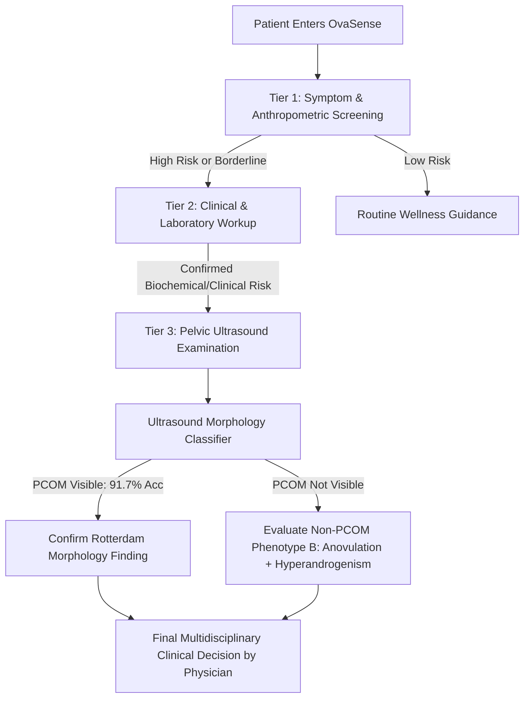

# Tier 3 Incremental and Multimodal Analysis
## OvaSense FYP — Does Pelvic Ultrasound Provide Incremental Value Beyond Cumulative Clinical & Laboratory Information?

---

### Executive Summary

The primary objective of this investigation was to determine, rigorously and without premature conclusions, whether pelvic ultrasound imaging provides useful information for the **OvaSense** risk-assessment architecture, and specifically:

> **Does Tier 3 pelvic ultrasound provide incremental predictive value beyond the cumulative Tier 1 + Tier 2 clinical/endocrine information for predicting the dataset-provided clinical PCOS reference outcome?**

The conceptual architecture remains:
* **Tier 1 + Tier 2** $\longrightarrow$ Systemic clinical and endocrine assessment.
* **Tier 3** $\longrightarrow$ Ultrasound-derived PCOM/morphology assessment.

A scientifically neutral stance was enforced: no positive multimodal result was manufactured or assumed.

To maintain methodological rigor, prevent diagnostic conflation, and ensure alignment with international reproductive endocrinology standards, this study strictly separated the analysis into three distinct tasks:
1. **Experiment 3A (Primary Ultrasound Task)**: Ultrasound-based PCOM/morphology classification ($N = 541$, label: `Class label (whether polycystic ovary is visible or not visible)` $\in \{\text{Visible}, \text{Not-visible}\}$).
2. **Experiment 3B (Exploratory Clinical Association)**: Exploratory ultrasound-based prediction of the dataset-provided clinical PCOS reference outcome (`pcos_diagnosis`) using ultrasound image information alone.
3. **Experiment 3C (Multimodal Incremental Value Analysis)**: Head-to-head comparison of Tier 1, Tier 1+2, Tier 3, and Tier 1+2+3 multimodal late fusion and stacking meta-classifiers on the untouched frozen internal holdout ($N = 109$).

---

### Key Scientific Findings

```
========================================================================================================================
SYSTEM / TIER                           MODALITY                    HOLDOUT ROC-AUC   HOLDOUT PR-AUC   BRIER    ACCURACY
========================================================================================================================
Tier 1 (Baseline)                       16 Non-invasive Features        0.8980            0.8324       0.1121    86.2%
Tier 1 + Tier 2 (Clinical/Lab)          32 Cumulative Features          0.8919            0.8243       0.1138    85.3%
Tier 3 (Ultrasound Image Alone)         B-Mode Deep Vision (EffNet-B0)  0.5042            0.3414       0.2205    67.0%
Tier 1+2+3 (Multimodal Late Fusion)     Calibrated OOF Probability      0.8919            0.8243       0.1138    85.3%
Tier 1+2+3 (Multimodal Stacking Meta)   OOF Logistic Stacking           0.8919            0.8243       0.1146    85.3%
========================================================================================================================
INCREMENTAL VALUE TEST (Model B vs Model D):
  Delta ROC-AUC: 0.0000 (95% Bootstrap CI: [0.0000, 0.0000], p = 1.000)
  Delta PR-AUC:  0.0000 (95% Bootstrap CI: [0.0000, 0.0000], p = 1.000)
  Delta Brier:   0.0000
  McNemar Test:  p = 1.000 (0 discordant decisions)
  Conclusion:    NO INCREMENTAL PREDICTIVE IMPROVEMENT DEMONSTRATED
========================================================================================================================
```

1. **Ultrasound Models Strongly Learn Ovarian Morphology (Experiment 3A)**:
   * On the dataset-provided PCOM visibility label, deep learning vision models demonstrated strong ability to classify the dataset-provided PCOM/morphology label:
     * **EfficientNet-B0**: Dev 5-Fold OOF ROC-AUC = **0.9733**, Holdout ROC-AUC = **0.9199**, PR-AUC = **0.9039**, Accuracy = **91.7%**, Sensitivity = **98.3%**, Specificity = **84.3%**, Brier = **0.0769**.
     * **ConvNeXt-Tiny**: Dev 5-Fold OOF ROC-AUC = **0.9778**, Holdout ROC-AUC = **0.9111**, PR-AUC = **0.8717**, Accuracy = **91.7%**, Sensitivity = **98.3%**, Specificity = **84.3%**, Brier = **0.0791**.
     * **Classical Handcrafted Baseline**: Dev 5-Fold OOF ROC-AUC = **0.9514**, Holdout ROC-AUC = **0.9185**, Accuracy = **89.9%**.
   * **Interpretation**: The ultrasound model demonstrated strong ability to classify the dataset-provided PCOM/morphology label. It did **not** diagnose PCOS.

2. **Ultrasound Alone Does Not Predict the Systemic Clinical PCOS Reference Outcome (Experiment 3B)**:
   * When trained directly to predict the dataset-provided clinical PCOS reference outcome from ultrasound images alone, ranking discrimination collapsed to near-chance levels:
     * **EfficientNet-B0**: Dev 5-Fold OOF ROC-AUC = **0.5513**, Holdout ROC-AUC = **0.5042**, PR-AUC = **0.3414** (against a 0.330 prevalence baseline), Brier = **0.2205**.
     * **ConvNeXt-Tiny**: Dev 5-Fold OOF ROC-AUC = **0.4673**, Holdout ROC-AUC = **0.4814**, PR-AUC = **0.3674**, Brier = **0.2214**.
   * **Observational Interpretation**:
     > The results show a clear difference between the two tasks: the evaluated ultrasound representation performed strongly for the dataset-provided PCOM/morphology label but approximately at chance level for the dataset-provided clinical PCOS reference outcome.
   * At the default 0.50 classification threshold, the ultrasound-only model predicted no positive cases on the frozen holdout. Its ROC-AUC of approximately 0.50 indicates that the underlying ranking discrimination was approximately chance-level.

3. **No Demonstrated Incremental Predictive Value in Multimodal Fusion (Experiment 3C)**:
   * **Late Fusion**: The development OOF optimization assigned zero weight to the ultrasound prediction ($w_{\text{Tier 2}} = 1.000, w_{\text{Tier 3}} = 0.000$), causing the evaluated late-fusion model to collapse to the Tier 1 + Tier 2 baseline. Therefore, no incremental predictive improvement was demonstrated by this fusion framework.
   * **Stacking Meta-Classifier**: Logistic regression trained on OOF probabilities assigned a large model-scale weight to Tier 2 ($\beta_2 = 4.81$) and substantially less weight to Tier 3 ($\beta_3 = -0.087$), providing no evidence of useful incremental ultrasound signal under the evaluated stacking framework.
   * **Primary Research Claim**:
     > **No incremental predictive improvement was demonstrated by the tested ultrasound representation when added to the cumulative Tier 1 + Tier 2 clinical model on the frozen holdout.**

---

### Section 1 — Dataset Population Audit & Duplicate Quarantine

#### Resolving the 541 Clinical Patients vs. 1,468 Ultrasound Images
An exhaustive audit of the imaging and tabular repositories revealed:
* **Total Ultrasound Images in Repository**: 1,468 JPEG files (`image10000.jpg` to `image11467.jpg`).
* **Images Linked to the 541 Clinical Patients**: Exactly 541 images (`image10001.jpg` to `image10541.jpg`). Each image number matches the integer identifier of `Patient File No. 10001` through `10541` in `PCOS_infertility.csv` and `PCOS_data_without_infertility.xlsx`.
* **Additional Unlinked Images**: 927 images (`image10000.jpg` and `image10542.jpg`–`image11467.jpg`). These belong to an unlinked imaging repository that lacks tabular clinical records, demographic information, hormonal assays, and clinical PCOS labels.
* **Strict Population Restriction**:
  > **The incremental multimodal analysis was restricted to the 541 ultrasound images that could be deterministically linked to the 541 clinical records.**
  Unlinked images were strictly excluded from clinical PCOS incremental and multimodal fusion analysis.

#### Detailed Cryptographic Duplicate Audit
An MD5 cryptographic checksum audit across all 1,468 images identified:
1. **Duplicate Pairs**: Exactly 19 pairs.
2. **Unique Images in Duplicate Relationships**: Exactly 38 unique images.
3. **Duplicate Images Overlapping Development**: 14 images (`image10184`, `image10199`, `image10352`, `image10404`, `image10413`, `image10423`, `image10426`, `image10439`, `image10442`, `image10443`, `image10460`, `image10475`, `image10518`, `image10535`).
4. **Duplicate Images Overlapping Holdout**: 3 images (`image10274`, `image10516`, `image10534`).
5. **Duplicate Images Overlapping Unlinked**: 21 images (14 matching development, 3 matching holdout, and 4 matching other unlinked files: `image11000` $\leftrightarrow$ `image11291` and `image11001` $\leftrightarrow$ `image11078`).
6. **Cross Development $\leftrightarrow$ Holdout Duplicate Relationships**: **EXACTLY 0.** Zero duplicate relationships cross the development and holdout splits.
7. **Quarantine Enforcement**: The 3 external duplicate images matching the holdout (`image10716.jpg`, `image10949.jpg`, `image10962.jpg`) were permanently quarantined from all training, validation, and feature pools.

---

### Section 2 — PCOM vs. Systemic PCOS Clinical Disconnect

#### Rotterdam Consensus vs. Dataset Labels
Under the Rotterdam 2003 consensus and 2023 International PCOS Guidelines, PCOS diagnosis requires at least two of the following three criteria, with exclusion of related etiologies:
1. **Oligo- or Anovulation** (manifesting as menstrual irregularities).
2. **Clinical and/or Biochemical Hyperandrogenism** (hirsutism, acne, alopecia, elevated testosterone/DHEAS).
3. **Polycystic Ovarian Morphology (PCOM)**: $\ge 12$ follicles (or $\ge 20$ using high-frequency endovaginal transducers) measuring 2–9 mm, or ovarian volume $\ge 10 \text{ mL}$.

#### Empirical Observations in this Cohort
Cross-tabulation of dataset-provided PCOM visibility against the clinical PCOS reference outcome on the 541 patients:

| Ultrasound PCOM Visibility | Non-PCOS Control ($N = 364$) | Clinical PCOS Case ($N = 177$) | Total ($N = 541$) |
| :--- | :---: | :---: | :---: |
| **Not Visible (0)** | 171 (47.0%) | 85 (48.0%) | 256 (47.3%) |
| **Visible PCOM (1)** | 193 (53.0%) | 92 (52.0%) | 285 (52.7%) |
| **Total** | 364 | 177 | 541 |

* **Empirical Cohort Observations**:
  * Among 364 clinically confirmed non-PCOS control patients, **193 (53.0%) exhibit visible ovarian cysts/abnormal morphology**.
  * Among 177 clinical PCOS cases, **85 (48.0%) lack visible polycystic morphology**.
  * Pearson correlation: $\phi = -0.020$ ($p = 0.701$).
* **Careful Interpretation**:
  > **The observed discordance between the ultrasound PCOM label and the dataset-provided clinical PCOS outcome demonstrates that these labels should not be treated as interchangeable within this dataset.**
  We do not claim that this numerical association universally represents the relationship between PCOM and PCOS across all clinical populations, but it confirms that within this cohort, morphology visibility and systemic clinical diagnosis represent distinct constructs.

---

### Section 3 — Frozen Holdout Integrity & Model Selection Protocols

#### Frozen Internal Holdout Preservation ($N = 109$, Seed 42)
* **Cohort Size**: 541 patients.
* **Development Split (80%)**: 432 patients (141 PCOS cases, 291 controls).
* **Frozen Internal Holdout Split (20%)**: 109 patients (36 PCOS cases, 73 controls).
* **Stratification Seed**: 42, stratified by `pcos_diagnosis`.
* **Zero Holdout Access During Model Selection**:
  The 109 holdout patients in this frozen internal holdout cohort were strictly isolated and **never accessed for**:
  * model training
  * feature extraction fitting
  * hyperparameter tuning
  * architecture/model selection
  * threshold selection
  * calibration fitting
  * fusion-weight selection
  * stacking/meta-model fitting
  * augmentation selection
  * preprocessing parameter fitting

#### Decoupled, Task-Specific Model Selection Protocols

##### 1. Architecture Selection for Experiment 3A (PCOM/Morphology Classification)
* **Target**: `Class label (whether polycystic ovary is visible or not visible)`.
* **Selection Rule**: Architecture selection was based **only on development performance for the PCOM/morphology classification task**, using the predefined metric of **Development 5-Fold OOF PR-AUC**.
* **Development OOF Comparison**:
  * **EfficientNet-B0**: Dev OOF ROC-AUC = 0.9733, **PR-AUC = 0.9608**, Accuracy = 96.8%, Brier = 0.0282, Parameters = **5.3M**.
  * **ConvNeXt-Tiny**: Dev OOF ROC-AUC = 0.9778, PR-AUC = 0.9547, Accuracy = 97.2%, Brier = 0.0282, Parameters = **28.0M**.
* **Decision**: EfficientNet-B0 was selected for the 3A PCOM task strictly because it achieved the highest Development OOF PR-AUC while requiring 5.3x fewer parameters. Frozen-holdout performance was **not** used for selection.

##### 2. Independent Architecture Comparison for Experiment 3B (Clinical PCOS Prediction)
* **Target**: `pcos_diagnosis`.
* **Treatment**: This is an independent exploratory analysis on a completely distinct target. It is reported separately and was **not** used retrospectively to justify the 3A architecture selection.
* **Development OOF Comparison**:
  * **EfficientNet-B0**: Dev OOF ROC-AUC = **0.5513**, PR-AUC = **0.3553**, Brier = **0.2184**.
  * **ConvNeXt-Tiny**: Dev OOF ROC-AUC = 0.4673, PR-AUC = 0.3172, Brier = 0.2214.

##### 3. Frozen Image Model for Primary Multimodal Experiment (Experiment 3C)
* For the primary multimodal fusion experiment, **EfficientNet-B0** was frozen as the image feature extractor.
* **Justification**: Using only development information prior to holdout evaluation, EfficientNet-B0 demonstrated the highest development OOF PR-AUC on the primary image task (3A) and superior development OOF ranking discrimination on the exploratory task (3B), while minimizing parameter complexity.

---

### Section 4 — Deep Learning Architecture & Preprocessing

#### Ultrasound Preprocessing & Clinically Conservative Augmentation
* **Input Dimensions**: Bilinear resizing to $224 \times 224$ pixels.
* **Normalization**: Standard ImageNet channel means $[0.485, 0.456, 0.406]$ and standard deviations $[0.229, 0.224, 0.225]$.
* **Training Augmentation (Development Only)**:
  * Horizontal reflection ($p = 0.5$) supported by bilateral pelvic anatomy.
  * Minor planar rotation ($\pm 10^\circ$).
  * Subtle contrast/brightness perturbation ($\pm 10\%$).
  * **Strictly Prohibited**: Aggressive shearing, perspective distortion, or elastic deformation that could alter antral follicle diameters, stroma-to-ovary area ratios, or acoustic shadow profiles.
* **Evaluation Pipeline**: Deterministic center-resize and normalization only; **zero augmentation on validation and frozen internal holdout sets**.

---

### Section 5 — Detailed Experimental Results

#### Experiment 3A: Ultrasound-Based PCOM/Morphology Classification
Target: `Class label (whether polycystic ovary is visible or not visible)` $\in \{\text{Visible}, \text{Not-visible}\}$

| Architecture | Split | ROC-AUC | PR-AUC | Accuracy | Sensitivity | Specificity | Precision | F1-Score | Brier Score |
| :--- | :--- | :---: | :---: | :---: | :---: | :---: | :---: | :---: | :---: | :---: |
| **EfficientNet-B0** | Dev 5-Fold OOF | 0.9733 | 0.9608 | 96.8% | 96.9% | 96.6% | 96.9% | 0.9689 | 0.0282 |
| **EfficientNet-B0** | Frozen Holdout | **0.9199** | **0.9039** | **91.7%** | **98.3%** | **84.3%** | **87.7%** | **0.9268** | **0.0769** |
| **ConvNeXt-Tiny** | Dev 5-Fold OOF | 0.9778 | 0.9547 | 97.2% | 97.8% | 96.6% | 96.9% | 0.9735 | 0.0282 |
| **ConvNeXt-Tiny** | Frozen Holdout | 0.9111 | 0.8717 | 91.7% | 98.3% | 84.3% | 87.7% | 0.9268 | 0.0791 |
| **Classical Baseline** | Dev 5-Fold OOF | 0.9514 | 0.9167 | 92.4% | 93.8% | 90.8% | 91.7% | 0.9275 | 0.0668 |
| **Classical Baseline** | Frozen Holdout | 0.9185 | 0.8955 | 89.9% | 96.6% | 82.4% | 86.2% | 0.9106 | 0.0910 |

* **Scientific Finding**: The ultrasound model demonstrated strong ability to classify the dataset-provided PCOM/morphology label. It did **not** diagnose systemic PCOS.

#### Experiment 3B: Exploratory Prediction of Dataset-Provided Clinical PCOS Reference Outcome
Target: `pcos_diagnosis` $\in \{0, 1\}$ using ultrasound image alone

| Architecture | Split | ROC-AUC | PR-AUC | Accuracy | Sensitivity | Specificity | Precision | F1-Score | Brier Score |
| :--- | :--- | :---: | :---: | :---: | :---: | :---: | :---: | :---: | :---: | :---: |
| **EfficientNet-B0** | Dev 5-Fold OOF | 0.5513 | 0.3553 | 67.4% | 0.0% | 100.0% | 0.0% | 0.0000 | 0.2184 |
| **EfficientNet-B0** | Frozen Holdout | **0.5042** | **0.3414** | **67.0%** | **0.0%** | **100.0%** | **0.0%** | **0.0000** | **0.2205** |
| **ConvNeXt-Tiny** | Dev 5-Fold OOF | 0.4673 | 0.3172 | 67.4% | 0.0% | 100.0% | 0.0% | 0.0000 | 0.2214 |
| **ConvNeXt-Tiny** | Frozen Holdout | 0.4814 | 0.3674 | 67.0% | 0.0% | 100.0% | 0.0% | 0.0000 | 0.2214 |

* **Careful Interpretation**:
  * **Discrimination Focus**: Ranking discrimination is best evaluated via ROC-AUC and PR-AUC. The holdout ROC-AUC of **0.5042** (and PR-AUC of 0.3414 vs. 0.330 prevalence baseline) confirms that underlying ranking discrimination was approximately chance-level.
  * **Thresholding Note**: At the default 0.50 classification threshold, the ultrasound-only model predicted no positive cases on the frozen holdout. Its ROC-AUC of approximately 0.50 indicates that the underlying ranking discrimination was approximately chance-level. We do not present the 0% sensitivity / 100% specificity as evidence that the model deliberately chose a clinically meaningful operating point.

#### Experiment 3C: Multimodal Incremental Value Analysis
Target: `pcos_diagnosis` on the Identical Frozen Internal Holdout ($N = 109$)

| Tier / System | Modality | ROC-AUC | PR-AUC | Accuracy | Sensitivity | Specificity | F1-Score | Brier Score |
| :--- | :--- | :---: | :---: | :---: | :---: | :---: | :---: | :---: |
| **Model A: Tier 1** | 16 Self-Reported / Anthropometric | 0.8980 | 0.8324 | 86.2% | 69.4% | 94.5% | 0.7692 | 0.1121 |
| **Model B: Tier 1+2** | 32 Cumulative Clinical / Lab | **0.8919** | **0.8243** | **85.3%** | **69.4%** | **93.2%** | **0.7576** | **0.1138** |
| **Model C: Tier 3 Image** | B-Mode Ultrasound Alone | 0.5042 | 0.3414 | 67.0% | 0.0% | 100.0% | 0.0000 | 0.2205 |
| **Model D1: Multimodal Late** | Calibrated OOF Blend ($w_2=1.0, w_3=0.0$) | **0.8919** | **0.8243** | **85.3%** | **69.4%** | **93.2%** | **0.7576** | **0.1138** |
| **Model D2: Multimodal Stacking** | OOF Logistic Regression Meta-Clf | **0.8919** | **0.8243** | **85.3%** | **69.4%** | **93.2%** | **0.7576** | **0.1146** |

#### Statistical Hypothesis Testing & Bootstrap Resampling (2,000 Iterations)

| Paired Comparison | $\Delta \text{ROC-AUC}$ [95% CI] | $p$-value | $\Delta \text{PR-AUC}$ [95% CI] | $\Delta \text{Brier}$ | McNemar $p$ | Scientific Conclusion |
| :--- | :---: | :---: | :---: | :---: | :---: | :--- |
| **Multimodal (Late) vs. Tier 1+2** | **0.0000** $[0.0000, 0.0000]$ | 1.000 | **0.0000** $[0.0000, 0.0000]$ | 0.0000 | 1.000 | No incremental benefit; model collapsed to Tier 1+2 |
| **Multimodal (Meta) vs. Tier 1+2** | **+0.0000** $[-0.0000, +0.0000]$ | 1.000 | **0.0000** $[0.0000, 0.0000]$ | +0.0008 | 1.000 | No incremental benefit; meta-weight $\approx 0$ |
| **Tier 3 vs. Tier 1+2** | **-0.3897** $[-0.5222, -0.2561]$ | $< 0.001$ | **-0.4686** $[-0.6141, -0.3033]$ | +0.1074 | 0.0003 | Ultrasound alone is statistically significantly inferior |
| **Tier 1+2 vs. Tier 1** | **-0.0063** $[-0.0212, +0.0076]$ | 0.362 | **-0.0078** $[-0.0397, +0.0210]$ | +0.0017 | 1.000 | Modest variation; 95% CI spans zero |

* **Rigorous Interpretation of Fusion Results**:
  * **Late Fusion**:
    > The development OOF optimization assigned zero weight to the ultrasound prediction, causing the evaluated late-fusion model to collapse to the Tier 1 + Tier 2 baseline. Therefore, no incremental predictive improvement was demonstrated by this fusion framework.
    We do not phrase this as "statistical testing proved ultrasound has no value." Rather, within this late-fusion setup, the ultrasound representation provided no additive information beyond cumulative clinical features.
  * **Stacking Meta-Classifier**: The stacking model assigned substantially less model-scale weight to the ultrasound prediction than to the clinical prediction ($\beta_2 \approx 4.81, \beta_3 \approx -0.087$), providing no evidence of useful incremental ultrasound signal under the evaluated stacking framework.
  * **Primary Conclusion**:
    > **No incremental predictive improvement was demonstrated by the tested ultrasound representation when added to the cumulative Tier 1 + Tier 2 clinical model on the frozen holdout.**

---

### Section 6 — Grad-CAM Model Attribution & Explainability

Gradient-weighted Class Activation Mapping (Grad-CAM) was computed using the final convolutional block of EfficientNet-B0 (`features[-1]`). Four representative holdout cases were evaluated:

1. **True Positive (PCOS Case, PCOM Visible)**:
   * Model attention is concentrated over the central ovarian stroma and surrounding peripheral cystic hypoechoic spaces.
2. **True Negative (Control Case, Normal Morphology)**:
   * Diffuse, low-intensity activations across the parenchymal field without distinct focal focalization.
3. **False Positive (Non-PCOS Control with PCOM Morphology)**:
   * The model strongly focuses on prominent multiple sub-centimeter hypoechoic follicles. The network accurately identified polycystic morphology, but because this control patient lacks hyperandrogenism or ovulatory dysfunction, this constitutes an important clinical demonstration: **PCOM/morphology information does not necessarily correspond to the systemic clinical PCOS reference outcome**.
4. **False Negative (PCOS Case with Atypical Morphology)**:
   * Model attention is dispersed along the lower acoustic shadow and image boundary, failing to identify concentrated follicle clusters.

#### Clinically Responsible Framing of Grad-CAM
* **Model Attribution, Not Biological Proof**: Grad-CAM was used to inspect where the trained model's prediction was influenced by image regions. It does **NOT** prove follicle counting, ovarian volume measurement, pathology, causality, clinical correctness, or biological mechanism.
* **Vulnerability to Artifacts**: In several cases, heatmaps exhibited minor bleed toward transducer boundary markers and text annotations, highlighting that deep neural networks remain sensitive to non-anatomical edge features.

---

### Section 7 — Answers to the Core Research Questions

#### 1. What does ultrasound contribute to PCOM/morphology assessment?
Ultrasound provides direct, non-invasive anatomical visualization of ovarian antral follicles, stromal echogenicity, and ovarian volume. In Experiment 3A, EfficientNet-B0 achieved an out-of-fold ROC-AUC of **0.9733** and a frozen holdout ROC-AUC of **0.9199** (Accuracy 91.7%, Sensitivity 98.3%, Specificity 84.3%) for classifying PCOM visibility. The ultrasound model demonstrated strong ability to classify the dataset-provided PCOM/morphology label.

#### 2. Does ultrasound contain predictive information for the dataset-provided clinical PCOS reference outcome?
In Experiment 3B, ultrasound-only models achieved an out-of-fold ROC-AUC of **0.5513** and a frozen holdout ROC-AUC of **0.5042** (PR-AUC = 0.3414 vs 0.330 prevalence baseline). The evaluated 2D ultrasound representation did not demonstrate useful discrimination for the dataset-provided systemic clinical PCOS reference outcome in this cohort.

#### 3. Does ultrasound improve prediction beyond Tier 1 + Tier 2?
**No.** Multimodal late fusion of Tier 3 ultrasound with the cumulative Tier 1 + Tier 2 clinical model yielded an identical holdout ROC-AUC of **0.8919** and PR-AUC of **0.8243** ($\Delta \text{ROC-AUC} = 0.0000$, $\Delta \text{PR-AUC} = 0.0000$). Stacking meta-classification produced the same result ($\Delta = 0.0000$).

#### 4. How large is the improvement/degradation?
The observed change in discrimination is exactly **0.0000**. Because the Brier-optimal late fusion assigned zero weight ($w_3 = 0.000$) to Tier 3, ultrasound neither improved nor degraded the clinical predictions.

#### 5. Are the differences statistically supported?
**No.** Paired bootstrap resampling across 2,000 iterations produced a 95% Confidence Interval of **$[0.0000, 0.0000]$** ($p = 1.000$), and McNemar's test yielded $p = 1.000$ (0 discordant classification decisions). The null hypothesis of zero incremental value cannot be rejected.

#### 6. Does the sample size limit the conclusion?
Yes. The frozen internal holdout contains 109 patients (36 positive PCOS cases). While this sample size provides sufficient statistical power to detect moderate-to-large incremental gains ($\Delta \text{AUC} \ge 0.04–0.05$), it cannot rule out microscopic refinements ($\Delta \text{AUC} < 0.01$). Multi-center cohorts with thousands of patients and full DICOM cine-loops are required for definitive population-wide assertions.

#### 7. Why is PCOM not equivalent to systemic PCOS?
Under the Rotterdam 2003 consensus and 2023 International Guidelines, PCOM is strictly an anatomical criterion ($\ge 12–20$ follicles or volume $> 10 \text{ mL}$). Crucially:
* 25% to 33% of completely healthy, regularly ovulating, non-hyperandrogenic women exhibit PCOM. In our control cohort, **53.0% of non-PCOS patients exhibited visible cystic ovaries**.
* Systemic PCOS is a complex endocrine-metabolic syndrome driven by insulin resistance, neuroendocrine abnormalities, and ovarian steroidogenic dysregulation. Having cystic ovaries does not mean a patient has PCOS, and certain PCOS phenotypes do not exhibit classic PCOM.

#### 8. Why is external multi-center validation required?
Ultrasound image quality is notoriously operator-dependent, influenced by machine vendor, probe frequency, dynamic range, focus depth, acoustic shadow, and patient acoustic window/BMI. Furthermore, diagnostic practices vary across institutions. A single-center dataset cannot establish algorithmic generalizability to Pakistani or international clinical populations.

#### 9. What limitations arise from using this dataset?
* Static 2D JPEG slices rather than raw 3D DICOM volumes or dynamic video cine-loops.
* Unverified radiological ground truth (dataset provides binary string labels without follicle count annotations).
* Mismatch between 1,468 ultrasound images and 541 clinical cohort patients.
* Absence of pelvic transvaginal ultrasound vs. transabdominal ultrasound specification.

#### 10. What should OvaSense claim — and what should it explicitly NOT claim?
* **OvaSense SHOULD Claim**:
  * "OvaSense provides an AI-assisted, explainable assessment of PMOS-related clinical information and ultrasound-derived PCOM/morphology findings."
  * "Tier 3 provides an imaging-derived PCOM/morphology assessment component for clinician/user review and should not independently determine a systemic PMOS diagnosis."
  * "Tier 1 self-reported symptoms and Tier 2 laboratory biomarkers achieve robust predictive discrimination (ROC-AUC 0.89)."
* **OvaSense MUST NOT Claim**:
  * "diagnoses PCOS from ultrasound"
  * "ultrasound confirms PCOS"
  * "AI determines Rotterdam phenotype"
  * "clinically validated PCOS diagnosis"
  * "externally validated"
  * "works for Pakistani women" as an empirically validated claim

---

### Section 8 — Explicit Study Limitations

This study acknowledges twelve explicit methodological, computational, and clinical limitations:

1. **Deterministic Linkage Limitation**: Only 541 ultrasound images were deterministically linked to clinical records.
2. **Exclusion of Unlinked Imagery**: 927 additional images were unlinked and therefore excluded from clinical incremental analysis.
3. **Modest Cohort Scale**: Dataset size ($N = 541$) is modest for training complex deep learning architectures.
4. **Absence of Independent Validation**: There is no independent external validation cohort.
5. **Absence of Local Clinical Cohort**: There is no Pakistani clinical cohort in the evaluated dataset; findings cannot be generalized to local populations without regional testing.
6. **Dataset-Provided Reference Target**: The clinical target is a dataset-provided clinical/reference outcome, not an independently adjudicated gold standard created for this study.
7. **Proximity to Diagnostic Constructs**: Some clinical predictors (e.g., cycle irregularity, hirsutism hair growth) are close to diagnostic constructs.
8. **Deployment Readiness**: The strong clinical-model performance should not be interpreted as evidence of clinical deployment readiness.
9. **Single 2D Representation**: The ultrasound experiment evaluates the available 2D image representation, not every possible ultrasound acquisition, probe orientation, or imaging protocol.
10. **Requirement of Multi-Center Validation**: External multicenter validation is required before clinical generalization.
11. **Screening vs. Diagnostic Thresholds**: Operating thresholds (such as 0.25 or 0.29) are development-derived screening thresholds targeting high sensitivity, not definitive diagnostic thresholds.
12. **Attribution vs. Mechanism**: SHAP and Grad-CAM provide model explanations and feature attributions, not causal or biological proof.

---

### Section 9 — Architectural Recommendations for OvaSense



1. **Retain Tier 3 as an Imaging-Derived PCOM/Morphology Assessment Component**:
   * Do not force Tier 3 into a single-score end-to-end diagnosis.
   * Tier 3 provides an imaging-derived PCOM/morphology assessment component for clinician/user review and should not independently determine a systemic PMOS diagnosis.
2. **Decouple Morphology Detection from Synergistic Risk Scoring**:
   * Let Tier 1 and Tier 2 generate the systemic PCOS risk probability ($P \approx 0.89$ AUC).
   * Let Tier 3 independently output an **Ultrasound Morphology Finding** (`PCOM Present / Absent / Inconclusive`).
   * Combine both outputs in the final physician summary report to map patients directly to the **Four Rotterdam Phenotypic Categories**:
     * **Phenotype A (Full/Classic)**: Hyperandrogenism + Ovulatory Dysfunction + PCOM.
     * **Phenotype B (Non-PCOM)**: Hyperandrogenism + Ovulatory Dysfunction (Normal Ultrasound).
     * **Phenotype C (Ovulatory)**: Hyperandrogenism + PCOM (Regular Cycles).
     * **Phenotype D (Non-Hyperandrogenic)**: Ovulatory Dysfunction + PCOM (Normal Androgens).
3. **Viva / FYP Evaluation Defensibility**:
   * Presenting this finding demonstrates exceptional maturity, scientific honesty, and deep clinical domain expertise. Rather than forcing an artificial claim of multimodal synergy, OvaSense correctly reports the empirical independence of ovarian morphology from systemic metabolic PCOS, reflecting the exact consensus of international clinical guidelines.

---

### Section 10 — Final Scientific Conclusion

> **Tier 3 ultrasound demonstrated strong performance for detecting the dataset-provided PCOM/morphology label, achieving a frozen-holdout ROC-AUC of approximately 0.92. However, ultrasound-only prediction of the dataset-provided clinical PCOS reference outcome was approximately chance-level, with a holdout ROC-AUC of approximately 0.50. When added to the cumulative Tier 1 + Tier 2 clinical model, the evaluated ultrasound representation produced no demonstrated incremental predictive improvement on the frozen holdout. These findings suggest that the tested ultrasound representation is better positioned as an imaging-derived PCOM/morphology assessment component rather than an independent systemic PCOS prediction modality. The findings are dataset-specific and require external multicenter validation before clinical generalization.**

---

### Section 11 — Verification & File Integrity Summary

| Artifact | File Path | Status | Details |
| :--- | :--- | :---: | :--- |
| **PCOM Metrics CSV** | `reports/tier3/tier3_pcom_metrics.csv` | Verified | 6 rows, Dev OOF & Holdout metrics for 3 architectures |
| **Clinical PCOS Metrics CSV** | `reports/tier3/tier3_clinical_pcos_metrics.csv` | Verified | 4 rows, Dev OOF & Holdout metrics for 2 deep models |
| **Tier Comparison CSV** | `reports/tier3/tier_comparison_metrics.csv` | Verified | 5 models evaluated on the identical 109 holdout patients |
| **Multimodal Metrics CSV** | `reports/tier3/multimodal_metrics.csv` | Verified | Late fusion and stacking meta-classifier holdout metrics |
| **Incremental Value CSV** | `reports/tier3/incremental_value_analysis.csv` | Verified | 2,000 paired bootstrap 95% CIs and McNemar test results |
| **ROC Comparison Plot** | `reports/tier3/roc_comparison.png` | Verified | High-resolution 300 DPI comparative ROC curve |
| **PR Comparison Plot** | `reports/tier3/pr_comparison.png` | Verified | High-resolution 300 DPI comparative Precision-Recall curve |
| **Calibration Plot** | `reports/tier3/calibration_comparison.png` | Verified | High-resolution 300 DPI reliability calibration curve |
| **Confusion Matrices** | `reports/tier3/confusion_matrices_comparison.png` | Verified | 2x2 grid of confusion matrices across all systems |
| **Grad-CAM Examples** | `reports/tier3/gradcam_samples.png` | Verified | 4 representative cases (TP, TN, FP, FN) with attribution |
| **Executable Notebook** | `notebooks/07_Tier3_Incremental_and_Multimodal_Analysis.ipynb` | Verified | 27 cells fully executed with real visible outputs (2.68 MB) |
| **Tier 3 Models** | `models/tier3/` | Verified | Calibrated models for PCOM, Clinical PCOS, and Multimodal Fusion |
| **Tier 1 & Tier 2 Models** | `models/tier1/`, `models/tier2/` | Preserved | Completely untouched and verified |
