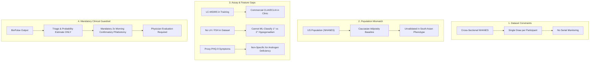

# Scientific & Clinical Limitations of BioPulse AI (Male Endocrine Architecture)

**Document Version**: 1.0.0  
**Phase**: Phase 3 Research & Evaluation Layer  
**Target Population**: Adult Men Aged 19–60 (Screening / Evidence Organization)  
**Status**: Formal Academic & Clinical Audit  

---

## Executive Summary & Non-Diagnostic Framing

> [!IMPORTANT]
> **Regulatory and Clinical Classification**:
> BioPulse is an AI-assisted progressive screening and evidence-organization framework. **BioPulse does not diagnose hypogonadism, androgen deficiency, or any endocrine pathology.** Clinical diagnosis of male hypogonadism strictly requires:
> 1. Persistent, characteristic symptoms and clinical signs of androgen deficiency (e.g., loss of libido, erectile dysfunction, decreased spontaneous erections, loss of axillary/pubic hair, osteopenia, fatigue).
> 2. Unequivocal, consistently subnormal serum Total Testosterone levels confirmed on **at least two separate morning blood samples** drawn between 07:00 and 11:00 AM in a fasting, rested state (Endocrine Society, AUA, and EAU Clinical Practice Guidelines).
> 3. Differential diagnosis excluding transient systemic illness, acute caloric restriction, medication-induced suppression (e.g., exogenous opioids, corticosteroids, anabolic steroids), and hyperprolactinemia.

The models and algorithmic pipelines documented herein represent computational evidence-synthesis tools designed to triage patients, identify evidence gaps, compute pre-test and post-test probabilities, and organize laboratory findings for attending physicians.

---

## 1. Retrospective Dataset Constraints

The underlying statistical models in BioPulse Male Tier 1 and Tier 2 were trained and validated on public microdata from the **Centers for Disease Control and Prevention (CDC) National Health and Nutrition Examination Survey (NHANES)** cycles 2013–2014 and 2015–2016 ($N = 3,575$ adult men aged 19–60).

1. **Cross-Sectional Architecture**:
   - NHANES is an observational, cross-sectional population health survey designed for epidemiologic monitoring, not a longitudinal clinical registry.
   - Each respondent attended exactly one Mobile Examination Center (MEC) examination session and provided a single morning/afternoon phlebotomy draw.
   - Cross-sectional data precludes causal inference; models learn statistical associations between co-occurring physiological states (e.g., metabolic syndrome, SHBG suppression, hematocrit alteration) rather than the temporal trajectory of testosterone decline.

2. **Absence of Prospective Clinical Follow-Up**:
   - The dataset contains no records of clinical therapeutic interventions (e.g., lifestyle modification, weight reduction, gonadotropin therapy, testosterone replacement therapy [TRT]), subsequent symptom resolution, or adverse cardiovascular events post-draw.
   - The predictive utility of the models is limited to static risk stratification at a single point in time.

---

## 2. Dataset Population Mismatch (Epidemiologic Shift)

A primary limitation of the current models is the demographic and geographical divergence between the derivation cohort and the target user base.

| Domain | Derivation Cohort (CDC NHANES 2013–2016) | Target Cohort (Pakistani / South Asian Adult Men) | Clinical Risk & Discrepancy |
| :--- | :--- | :--- | :--- |
| **Geographic Origin** | United States (Nationally representative) | Pakistan (South Asia, urban & peri-urban) | Environmental, dietary, and genetic variance |
| **Ethnic Distribution** | Non-Hispanic White (36%), Hispanic/Mexican (28%), Non-Hispanic Black (21%), Asian (11%) | South Asian / Pakistani (Punjabi, Pashtun, Sindhi, Balochi, Muhajir) | Different baseline SHBG levels and androgen receptor CAG repeat polymorphism lengths |
| **Metabolic Phenotype** | Caucasian obesity phenotype (subcutaneous adiposity) | Asian Indian / South Asian "Thin-Fat" phenotype (high visceral fat, low muscle mass at lower BMI) | WHO BMI cut-offs underestimate metabolic and gonadal risk in South Asians |
| **Cardiometabolic Baseline** | Moderate early-onset T2D prevalence | High early-onset insulin resistance, non-alcoholic fatty liver disease (NAFLD), and early atherosclerosis | Hepatic SHBG suppression occurs at significantly lower BMIs in South Asian men |

**Consequence**: Direct application of Tier 1 (which weights standard BMI and waist circumference) to Pakistani men risks significant under-detection in non-obese men with high visceral adiposity, or over-flagging if waist cutoffs are misaligned.

---

## 3. Ground Truth Label Limitations

The binary classification target used for training and evaluating Model A, Model B, and Model C is defined as:
$$\text{Label} = \begin{cases} 1 & \text{if serum Total Testosterone} < 300\text{ ng/dL} \\ 0 & \text{if serum Total Testosterone} \ge 300\text{ ng/dL} \end{cases}$$

This definition possesses major clinical and methodological limitations:

1. **Single-Measurement Artifact**:
   - In clinical practice, up to 30% of men with an initial subnormal testosterone level exhibit normal concentrations upon repeat testing due to circadian variability, acute sleep deprivation, illness, or laboratory imprecision (Bhasin et al., J Clin Endocrinol Metab 2018).
   - NHANES microdata provides only a single phlebotomy draw per participant. Consequently, an unknown fraction of the 851 "positive" cases (23.8% prevalence) represent transient physiologic dips rather than true hypogonadal states.

2. **Fixed Threshold vs. Age-Specific & SHBG-Adjusted Physiology**:
   - The fixed 300 ng/dL cut-off is an arbitrary consensus threshold. 
   - A man with high SHBG (e.g., 65 nmol/L) and a Total T of 320 ng/dL may suffer from profoundly low Free Testosterone and symptomatic androgen deficiency, yet is categorized as "negative" ($\text{Label}=0$).
   - Conversely, an obese man with low SHBG (e.g., 14 nmol/L) and a Total T of 280 ng/dL may maintain normal calculated Free Testosterone ($>6.5\text{ ng/dL}$) and normal androgen receptor signaling, yet is categorized as "positive" ($\text{Label}=1$).

3. **Single-Draw Non-Diagnostic Guardrail (2026 Endocrine Society Guidance)**:
   - Current clinical guidelines—including the **Endocrine Society 2026 Clinical Statement**—specifically emphasize that a clinical diagnosis of male hypogonadism requires characteristic symptoms plus consistently low morning testosterone, confirmed on **at least two separate early-morning fasting measurements (07:00–11:00 AM)**.
   - BioPulse explicitly does not allow a single subnormal measurement to prove or establish a diagnosis of hypogonadism. In software, any single low testosterone measurement triggers an `INCOMPLETE_WORKUP` gap requiring repeat morning draws.

4. **Target Leakage Prohibition in ML Models**:
   - In BioPulse, Total Testosterone is **strictly excluded** from the Tier 2 predictive feature matrix. The ML screening models evaluate indirect metabolic, hematologic, and carrier markers, while Total Testosterone is reserved exclusively for the deterministic clinical pattern engine and longitudinal tracking.

---

## 4. Laboratory Measurement & Assay Discrepancies

1. **CDC Reference vs. Commercial Immunoassays**:
   - NHANES total testosterone concentrations were measured via **Isotope Dilution Liquid Chromatography-Tandem Mass Spectrometry (ID-LC-MS/MS)** at the CDC Environmental Health Laboratory, certified by the Hormone Standardization Program (HoSt). LC-MS/MS is the reference gold standard with high analytical accuracy and sensitivity across the entire physiological range ($<2.5\text{ ng/dL}$ lower limit of quantitation).
   - In practical deployment across Pakistan and community health systems, most private clinical laboratories utilize automated chemiluminescent or electrochemiluminescent immunoassays (CLIA/ECLIA).
   - Immunoassays suffer from cross-reactivity with other steroids (e.g., DHEA-S, androstenedione), matrix interference, and notorious inaccuracy in the subnormal testosterone range ($<300\text{ ng/dL}$), exhibiting deviations up to $\pm 20\text{--}35\%$ relative to LC-MS/MS.
   - Feeding immunoassay-derived laboratory values into an LC-MS/MS-trained model introduces assay-shift measurement error.

2. **Albumin and SHBG Methodologies**:
   - SHBG in NHANES was measured using a two-site immunoenzymometric assay; commercial laboratories use varying automated analyzers with non-harmonized reference intervals.

---

## 5. Missing Symptom & Clinical Variables

Due to constraints of the NHANES survey instrument, several critical clinical features required by international hypogonadism guidelines could not be included in Model A or Model C:

1. **Missing Androgen Deficiency Questionnaire (ADAM) Features**:
   - NHANES does not administer the St. Louis University ADAM (Androgen Deficiency in the Aging Male) questionnaire or the AMS (Aging Males' Symptoms) scale.
   - Key pathognomonic symptoms—specifically **loss of morning erections, erectile dysfunction, decreased libido, and loss of facial/body hair**—were absent from the public datasets.
   - The model relies on proxy psychiatric and somatic items from the PHQ-9 depression screening module (`low_energy`, `sleep_trouble`, `low_mood`, `low_interest`). While fatigue and mood changes correlate with low T, they are highly non-specific and occur in clinical depression, obstructive sleep apnea, hypothyroidism, and chronic stress.

2. **Absence of Gonadotropin (LH / FSH) & Prolactin Biomarkers**:
   - CDC NHANES public microdata for 2013–2016 does **not** include Luteinizing Hormone (LH), Follicle-Stimulating Hormone (FSH), or Prolactin for male participants.
   - Consequently, neither Model A, Model B, nor Model C can distinguish between **Primary Hypogonadism** (testicular failure: high LH/FSH, low T) and **Secondary Hypogonadism** (hypothalamic-pituitary axis suppression: low/inappropriate normal LH/FSH, low T).
   - BioPulse handles this through its deterministic **Hormonal Pattern Engine** (rule-based clinical knowledge layer) rather than ML predictions, requiring manual or lab input of LH/FSH.

---

## 6. Lack of Paired Longitudinal Repeated Testing (Model D Limitation)

The Endocrine Society guidelines explicitly require repeat morning testing prior to diagnostic confirmation.

1. **Inability to Scientifically Evaluate Model D**:
   - A true longitudinal machine learning model (Model D) requires a dataset with serial blood draws collected over weeks or months under standardized conditions.
   - Because no public paired dataset containing multi-timepoint morning testosterone, SHBG, and clinical follow-up for thousands of adult men exists, Model D could not be empirically benchmarked.
   - In accordance with rigorous scientific integrity, **synthetic longitudinal data was NOT fabricated**.
   - Instead, the longitudinal capability is architected in software via the `EvidenceState` temporal log and rule-based two-test requirement (`TWO_MORNING_TESTS_REQUIRED`), awaiting prospective clinical validation.

---

## 7. Subgroup Performance Discrepancies & Selection Biases

Our subgroup audit of 715 holdout test participants revealed significant performance disparities that clinicians and users must consider:

1. **Obese vs. Normal Weight Distortion in Tier 1**:
   - For **Obese men** ($\text{BMI} \ge 30$), Tier 1 screening achieved **100% sensitivity** (95/95 detected), but specificity collapsed to **1.84%** (3/163 true negatives). Almost every obese man is flagged as high risk because obesity heavily drives the model's coefficients.
   - For **Normal weight men** ($\text{BMI} < 25$), Tier 1 screening achieved **93.37% specificity**, but sensitivity dropped to **8.33%** (1/12 detected). Non-obese men with secondary hypogonadism (e.g., prolactinoma, Kallmann syndrome, pituitary compression) will be systematically missed by non-invasive Tier 1 screening alone.
   - **Clinical Mitigation**: Tier 1 must always be framed as an exploratory metabolic screen; normal weight men presenting with sexual dysfunction must never be reassured that their testosterone is normal based solely on a negative Tier 1 questionnaire.

2. **Diabetic Population Specificity Collapse**:
   - In men with diagnosed diabetes, Tier 1 sensitivity is 100%, but specificity is only 7.55%. Tier 1 cannot differentiate between uncomplicated diabetes and diabetes accompanied by hypogonadism without laboratory evaluation (Tier 2).

3. **Survival & Selection Bias**:
   - NHANES is restricted to non-institutionalized, ambulatory civilian populations. Men with severe acute illnesses, end-stage renal disease on hemodialysis, advanced cancer cachexia, or institutionalized status were excluded from sampling.

---

## 8. Summary of Research Constraints for Academic Defense

### Recommendation for Researchers and Clinicians

Any clinical deployment of BioPulse AI must be conducted under an IRB-approved prospective observational protocol. Clinicians should use BioPulse as an educational, interactive evidence synthesizer that flags missing workup components (e.g., unmeasured morning prolactin, unconfirmed single low testosterone) rather than an automated diagnostic oracle.
