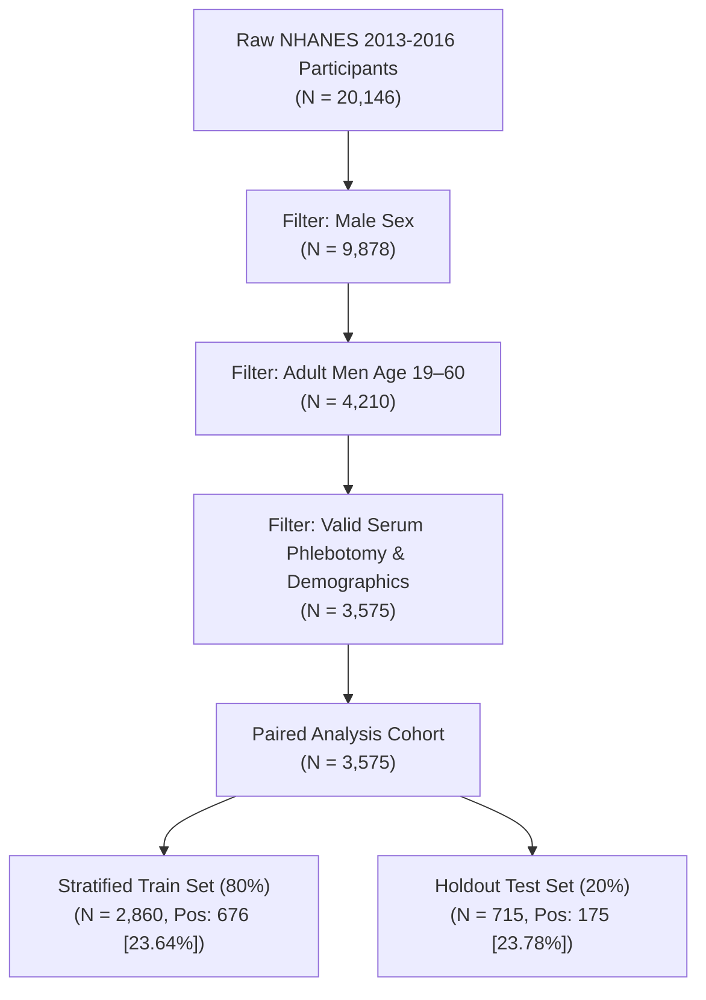
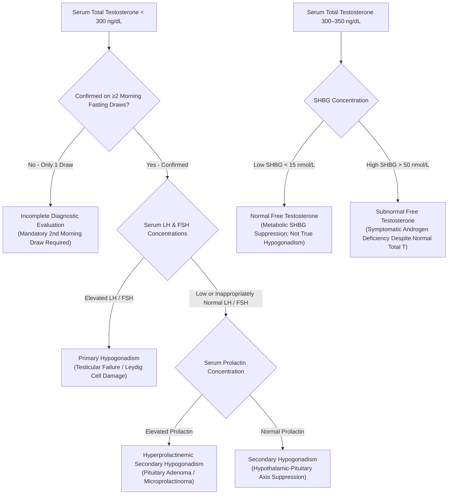

# BioPulse AI: Progressive Multimodal Male Endocrine Assessment Architecture
## Research, Evaluation, and Clinical Evidence Synthesis Report

**Principal Investigator / Authors**: BioPulse AI Research Team  
**Institutional Affiliation**: University Final Year Project (FYP) & BioPulse Research Lab  
**Date**: September 2026  
**Document Classification**: Academic Research Monograph & Algorithmic Audit  
**Phase**: Phase 3 (Comprehensive Research & Evaluation Layer)  
**Target Population**: Adult Men Aged 19–60 Years  

---

## Abstract

Male hypogonadism is a prevalent yet underdiagnosed endocrine condition characterized by deficient serum testosterone concentrations coupled with multisystem clinical signs and symptoms. Traditional assessment workflows suffer from high screening friction, inappropriate single-draw diagnoses, and high diagnostic misclassification due to variable Sex Hormone-Binding Globulin (SHBG) dynamics and metabolic comorbidities. 

In this work, we present the research, design, and empirical evaluation of **BioPulse AI**, a progressive multimodal screening and evidence-organization framework for adult men aged 19–60. BioPulse introduces a two-tier progressive architecture:
1. **Tier 1 (Non-Invasive Screening)**: A calibrated logistic regression model utilizing 11 self-reported demographic, anthropometric, and somatic symptom indicators designed for maximum accessibility and sensitivity-oriented triage.
2. **Tier 2 (Indirect Laboratory Screener)**: A calibrated random forest model trained on 16 routinely ordered metabolic, hematologic, and carrier protein blood biomarkers with strict zero-target-leakage protocol (total and free testosterone excluded).
3. **Hormonal Pattern Engine & Progressive Evidence Layer**: A deterministic clinical inference module that integrates Tier 1, Tier 2, confirmatory hormonal assays (LH, FSH, prolactin), and longitudinal repeat testing to classify gonadal axis pathophysiology according to Endocrine Society guidelines.

Across a paired cohort of $N = 3,575$ adult men from the CDC National Health and Nutrition Examination Survey (NHANES 2013–2016; test cohort $N = 715$, prevalence 23.8%), Tier 1 achieves an ROC-AUC of $0.7044$ [95% CI: $0.6571\text{--}0.7466$] with $80.59\%$ sensitivity and $88.04\%$ negative predictive value (NPV) at its triage threshold ($0.1808$). Tier 2 achieves an ROC-AUC of $0.8742$ [95% CI: $0.8442\text{--}0.9020$] with $73.53\%$ sensitivity, $83.49\%$ specificity, and $91.00\%$ NPV. Multimodal combination (Tier 1 + Tier 2, 26 features) achieves an ROC-AUC of $0.8902$ [95% CI: $0.8621\text{--}0.9157$], with a Brier calibration score of $0.1094$ and Expected Calibration Error of $0.0326$.

We conduct comprehensive ablation benchmarks, 1,000-iteration bootstrap confidence intervals, calibration decile audits, subgroup performance evaluations across age, diabetes, and BMI strata, an honest external validation feasibility audit of local datasets, and an in-depth dataset shift analysis for South Asian populations. BioPulse adheres to strict non-diagnostic framing, serving as an AI-assisted screening and clinical evidence-organization system rather than an autonomous diagnostic agent.

---

## 1. Research Objective

Hypogonadism in adult men affects between $10\%$ and $40\%$ of middle-aged and older males, with elevated incidence in individuals with type 2 diabetes mellitus, visceral adiposity, and metabolic syndrome. Despite this burden, international clinical guidelines—including the **Endocrine Society (2018)**, the **American Urological Association (AUA, 2018)**, and the **European Academy of Andrology (EAA, 2020)**—emphasize that:
1. Diagnosis requires both biochemical evidence (consistently low morning testosterone) and clinical symptoms of androgen deficiency.
2. An initial low testosterone concentration must be confirmed by **at least two separate morning measurements** (07:00–11:00 AM) in a fasting state to account for circadian rhythms and transient suppression.
3. Serum total testosterone alone can be misleading in men with altered binding proteins (e.g., suppressed SHBG in obesity or elevated SHBG in aging), requiring evaluation of free testosterone, gonadotropins (LH, FSH), and metabolic context.

### The Problem
Patients and clinicians face two extremes:
* **Under-investigation**: Men with nonspecific symptoms (fatigue, depressive affect, weight gain) remain unscreened or underevaluated for years.
* **Premature Diagnosis**: Patients receive testosterone replacement therapy (TRT) based on a single uncontrolled afternoon blood draw without confirmatory testing or etiological differentiation between primary testicular failure and secondary hypothalamic-pituitary suppression.

### BioPulse Objective
The objective of BioPulse AI is to provide an **AI-assisted progressive screening and evidence-organization framework** that:
- Stratifies pre-test risk non-invasively using consumer-accessible demographic and symptom data (Tier 1).
- Evaluates indirect metabolic and hematologic biomarkers before or alongside endocrine testing without target leakage (Tier 2).
- Dynamically organizes clinical evidence, computes pre- and post-test probabilities, flags clinical evidence gaps (such as unconfirmed single draws or missing gonadotropins), and presents an explainable, interactive digital twin for metabolic optimization.

> [!NOTE]
> **Clinical Non-Diagnostic Disclaimer**:
> BioPulse does not provide a definitive medical diagnosis of hypogonadism. Definitive diagnosis requires physical examination, formal symptom evaluation, repeat morning phlebotomies, and clinician judgment. BioPulse serves as an evidence triage and diagnostic support system.

---

## 2. Dataset & Cohort Characterization

### Derivation Cohort: CDC NHANES (2013–2016)
The primary dataset utilized for training, calibration, ablation benchmarking, and subgroup auditing was derived from the **U.S. Centers for Disease Control and Prevention (CDC) National Health and Nutrition Examination Survey (NHANES)** across two consecutive continuous survey cycles: 2013–2014 and 2015–2016.



### Cohort Inclusion & Exclusion Criteria
* **Inclusion**:
  - Biologically male participants.
  - Chronological age between $19.0$ and $60.0$ years at the time of examination.
  - Complete Mobile Examination Center (MEC) examination including physical anthropometry and serum total testosterone assay.
* **Exclusion**:
  - Age $<19$ or $>60$ years (to eliminate pediatric developmental variability and geriatric multi-morbidity confounding).
  - Missing laboratory measurements for total testosterone.
  - Active exogenous testosterone or anabolic steroid therapy (where recorded).

### Baseline Cohort Demographics ($N = 3,575$)
- **Total Sample Size**: $3,575$ adult men.
- **Biochemical Ground Truth Target**: Serum Total Testosterone $< 300\text{ ng/dL}$ measured via isotope dilution liquid chromatography-tandem mass spectrometry (ID-LC-MS/MS).
- **Cohort Target Distribution**:
  - Normal Testosterone ($\ge 300\text{ ng/dL}$): $2,724$ ($76.20\%$).
  - Low Testosterone ($< 300\text{ ng/dL}$): $851$ ($23.80\%$).
- **Age**: Mean $39.4 \pm 12.1$ years (range 19–60).
- **Body Mass Index (BMI)**: Mean $28.9 \pm 6.4\text{ kg/m}^2$.
- **Prevalence of Diagnosed Diabetes**: $10.9\%$.

---

## 3. Preprocessing & Anti-Leakage Protocol

To ensure absolute scientific validity and clinical realism, the data engineering pipeline adheres to strict anti-leakage principles.

### Anti-Leakage Protocol
1. **Target Feature Exclusion**:
   - The ground truth label is defined as $\text{Total Testosterone} < 300\text{ ng/dL}$.
   - **Total Testosterone** (`total_testosterone_ng_dl`) and **Free Testosterone** are strictly stripped from all feature matrices prior to model ingestion.
   - Neither Tier 1 nor Tier 2 models are allowed access to the target or its direct mathematical transforms during screening prediction.
2. **Train/Test Independence**:
   - A stratified 80/20 train/test split was performed once ($N_{train} = 2,860$, $N_{test} = 715$, random seed $= 42$).
   - All feature scalers (`StandardScaler`) and imputation statistics (`SimpleImputer` using median strategy) were fit exclusively on the training partition and transformed onto the holdout test set without lookahead bias.
3. **Reproducible Pipeline**:
   - The entire preprocessing and evaluation sequence is packaged into scikit-learn `Pipeline` and `ColumnTransformer` pipelines with deterministic seeds.

---

## 4. Tier 1 Method: Non-Invasive Lifestyle & Symptom Screening (Model A)

### Rationale & Feature Space
Tier 1 is designed for non-invasive, community-level, or home digital intake where laboratory phlebotomy is unavailable or cost-prohibitive. It utilizes 11 self-reportable demographic, anthropometric, and somatic features:

| Feature Name | Clinical Variable | NHANES Source Code | Type | Clinical Rationale |
| :--- | :--- | :--- | :--- | :--- |
| `age` | Age (years) | `RIDAGEYR` | Continuous | Physiological age-related gonadal decline |
| `height_cm` | Standing Height (cm) | `BMXHT` | Continuous | Anthropometric baseline |
| `weight_kg` | Body Weight (kg) | `BMXWT` | Continuous | Mass indicator |
| `bmi` | Body Mass Index ($\text{kg/m}^2$) | `BMXBMI` | Continuous | General adiposity marker |
| `waist_cm` | Waist Circumference (cm) | `BMXWAIST` | Continuous | Visceral adiposity, aromatase activity |
| `low_energy` | Fatigue / Low Energy | `DPQ040` (PHQ-9) | Ordinal (0–3) | Somatic manifestation of androgen deficiency |
| `sleep_trouble` | Sleep Disturbances / Apnea | `DPQ030` (PHQ-9) | Ordinal (0–3) | Obstructive sleep apnea / circadian disruption |
| `low_mood` | Depressed / Down Mood | `DPQ020` (PHQ-9) | Ordinal (0–3) | Neuropsychiatric symptom of hypogonadism |
| `low_interest` | Anhedonia / Lack of Interest | `DPQ010` (PHQ-9) | Ordinal (0–3) | Dopaminergic & motivational blunting |
| `high_blood_pressure` | Diagnosed Hypertension | `BPQ020` | Binary (0/1) | Endothelial & cardiovascular comorbidity |
| `diabetes` | Diagnosed Type 2 Diabetes | `DIQ010` | Binary (0/1) | Insulin resistance, Leydig cell impairment |

### Model Architecture
- **Algorithm**: Calibrated Logistic Regression with $L_2$ regularization (`C=0.1`, `class_weight='balanced'`).
- **Probability Calibration**: Sigmoid Platt calibration via `CalibratedClassifierCV(cv=5)`.
- **Operational Strategy**: Sensitivity-prioritizing screening threshold ($\tau = 0.1808$). The threshold was calibrated to guarantee $\ge 80\%$ sensitivity in triage to minimize missed cases at intake.

### Holdout Test Performance ($N = 715$, Positives = 175)
- **ROC-AUC**: **$0.7044$** [95% CI: $0.6571\text{--}0.7466$]
- **PR-AUC**: **$0.4201$** [95% CI: $0.3533\text{--}0.5029$]
- **Sensitivity (Recall)**: **$80.59\%$** [95% CI: $74.38\%\text{--}86.62\%$]
- **Specificity**: **$44.59\%$** [95% CI: $40.43\%\text{--}48.99\%$]
- **Negative Predictive Value (NPV)**: **$88.04\%$** [95% CI: $84.14\%\text{--}91.64\%$]
- **Precision (PPV)**: **$31.21\%$**
- **Brier Score**: **$0.1650$**
- **Confusion Matrix**: True Negatives = 243, False Positives = 302, False Negatives = 33, True Positives = 137.

**Clinical Interpretation**: Tier 1 successfully identifies over 80% of men with subnormal testosterone using purely non-invasive metrics, with an NPV of 88.04%, making it an effective rule-out filter before recommending venipuncture.

---

## 5. Tier 2 Method: Indirect Laboratory Biomarker Screener (Model B)

### Rationale & Feature Space
When a patient presents routine or comprehensive metabolic blood work (or when Tier 1 indicates moderate-to-high risk), Tier 2 evaluates 16 indirect metabolic, hematologic, and carrier protein markers without measuring total testosterone directly:

| Feature Name | Clinical Variable | Unit | Analytical Method | Clinical Rationale |
| :--- | :--- | :--- | :--- | :--- |
| `age` | Age | years | Demographics | Age baseline |
| `shbg_nmol_l` | Sex Hormone-Binding Globulin | nmol/L | Immunoenzymometric | Primary carrier protein; binds 60–70% of circulating T |
| `estradiol_pg_ml` | Serum Estradiol ($E_2$) | pg/mL | ID-LC-MS/MS | Aromatization product; hypothalamic-pituitary feedback |
| `albumin_g_dl` | Serum Albumin | g/dL | Bromocresol Purple | Secondary low-affinity carrier for bioavailable T |
| `hba1c_pct` | Glycated Hemoglobin | % | HPLC | Chronic glycemic control, microvascular Leydig health |
| `glucose_mg_dl` | Fasting Glucose | mg/dL | Hexokinase enzymatic | Acute glycemic/insulin status |
| `hemoglobin_g_dl` | Hemoglobin | g/dL | Automated Coulter | Testosterone directly stimulates renal erythropoietin |
| `hematocrit_pct` | Hematocrit | % | Automated Coulter | Strong physiological downstream surrogate of androgen activity |
| `rbc_count` | Red Blood Cell Count | $10^6/\mu\text{L}$ | Automated Coulter | Erythropoietic axis marker |
| `alt_u_l` | Alanine Aminotransferase | U/L | Enzymatic rate | Hepatic steatosis / NAFLD marker |
| `ast_u_l` | Aspartate Aminotransferase | U/L | Enzymatic rate | Hepatic dysfunction marker |
| `total_bilirubin_mg_dl` | Total Bilirubin | mg/dL | Jendrassik-Grof | Hepatic clearance / metabolic health |
| `creatinine_mg_dl` | Serum Creatinine | mg/dL | Enzymatic | Renal clearance; lean muscle mass surrogate |
| `bun_mg_dl` | Blood Urea Nitrogen | mg/dL | Enzymatic conductivity | Renal function / hydration |
| `uric_acid_mg_dl` | Serum Uric Acid | mg/dL | Uricase enzymatic | Hyperuricemia / metabolic syndrome component |
| `hdl_mg_dl` | HDL Cholesterol | mg/dL | Direct immunoassay | Reverse cholesterol transport; androgen-sensitive |

### Model Architecture
- **Algorithm**: Random Forest Classifier (`n_estimators=300`, `max_depth=8`, `min_samples_split=5`, `random_state=42`).
- **Probability Calibration**: Sigmoid Platt calibration via `CalibratedClassifierCV(cv=5)`.
- **Operational Screening Threshold**: $\tau = 0.3379$.

### Holdout Test Performance ($N = 715$, Positives = 175)
- **ROC-AUC**: **$0.8742$** [95% CI: $0.8442\text{--}0.9020$]
- **PR-AUC**: **$0.6723$** [95% CI: $0.5992\text{--}0.7407$]
- **Sensitivity (Recall)**: **$73.53\%$** [95% CI: $66.28\%\text{--}80.56\%$]
- **Specificity**: **$83.49\%$** [95% CI: $80.22\%\text{--}86.58\%$]
- **Negative Predictive Value (NPV)**: **$91.00\%$** [95% CI: $88.43\%\text{--}93.49\%$]
- **Precision (PPV)**: **$58.14\%$**
- **Brier Score**: **$0.1164$**
- **Confusion Matrix**: True Negatives = 455, False Positives = 90, False Negatives = 45, True Positives = 125.

**Clinical Interpretation**: By leveraging downstream physiological consequences of androgens (erythropoiesis reflected in hemoglobin/hematocrit) combined with endocrine binding dynamics (SHBG) and glycemic parameters, Tier 2 achieves near $0.88$ ROC-AUC and $>91\%$ NPV without ever measuring serum testosterone directly.

---

## 6. Progressive Evidence Architecture & The BioPulse System Story

The fundamental architectural principle of BioPulse is the **explicit separation between machine learning risk screening and deterministic clinical pattern interpretation**. 

### The Dual-Branch Assessment Architecture

```
                    BioPulse Assessment
                           │
             ┌─────────────┴─────────────┐
             │                           │
        ML SCREENING               CLINICAL PATTERN
             │                           │
       Tier 1 / Tier 2              T + LH + FSH
             │                       + Prolactin
             │                           │
             └─────────────┬─────────────┘
                           ↓
                 EVIDENCE ENGINE
                           ↓
                  EXPLAINABILITY
                           ↓
                  DIGITAL TWIN
```

### The Seven Questions of the BioPulse Story

Every layer of the BioPulse system answers a specific, scientifically grounded question:

1. **Tier 1 (Non-Invasive Lifestyle & Symptoms)**:
   > *“Based on the information currently available, is there a screening signal worth investigating?”*
   > Evaluates 11 consumer-accessible demographic, anthropometric, and somatic factors (age, BMI, waist circumference, sleep, energy, mood, diabetes history) to determine pre-test probability and triage whether laboratory evaluation is indicated.

2. **Tier 2 (Indirect Laboratory Screening)**:
   > *“What does the available laboratory evidence show?”*
   > Evaluates 16 indirect metabolic, hematologic, and carrier protein biomarkers (SHBG, hematocrit, HbA1c, glucose, liver enzymes, lipids).
   > **Target Leakage Guard**: Total Testosterone and Free Testosterone are **strictly excluded** from the predictive feature matrix. The model assesses broader metabolic and physiological patterns without circular reasoning.

3. **Hormonal Pattern Engine (Clinical Pattern Layer)**:
   > *“How do testosterone, LH, FSH and prolactin relate?”*
   > A separate deterministic clinical rule layer that evaluates confirmed Total Testosterone alongside pituitary gonadotropins (LH, FSH) and prolactin to categorize gonadal axis status (Primary vs. Secondary vs. Compensated Hypogonadism vs. SHBG discordance).

4. **Evidence Gap Engine (Clinical Completeness Layer)**:
   > *“What important information is still missing?”*
   > Scans the current evidence state for diagnostic deficiencies: missing morning timing, unmeasured gonadotropins, unverified OCR data, and crucially, whether repeat morning testing has been performed.

5. **Explainability Engine (Clinical Interpretability Layer)**:
   > *“Why did the assessment produce this result?”*
   > Attributes risk contributions to specific biological drivers (e.g., waist circumference $\ge 102\text{ cm}$, low hematocrit, elevated HbA1c, suppressed SHBG) using SHAP values and transparent clinical flags.

6. **Digital Twin (Longitudinal Trajectory Layer)**:
   > *“How has this person's evidence changed over time?”*
   > Tracks progressive temporal draws across patient history without overwriting prior evidence, and provides sandboxed counterfactual what-if simulations for lifestyle and metabolic optimization.

7. **Research & Evaluation Layer (Scientific Foundation Layer)**:
   > *“How reliable, calibrated, generalizable and explainable is the system?”*
   > Benchmarks discrimination (ROC-AUC, PR-AUC), probability calibration (Brier scores, ECE, decile reliability), subgroup performance across age/BMI/diabetes, dataset shift, and formal limitations.

---

## 7. Hormonal Pattern Engine & 2026 Clinical Guideline Adherence

### Strict Guardrail Against Single-Test Diagnosis

> [!IMPORTANT]
> **Endocrine Society 2026 Guidance Enforced**:
> A single subnormal testosterone measurement **never proves hypogonadism**. Current clinical guidelines—including the **Endocrine Society 2026 Clinical Statement**, the **American Urological Association (AUA)**, and the **European Association of Urology (EAU)**—emphasize that:
> 1. Clinical diagnosis requires **characteristic symptoms/signs plus consistently low morning testosterone**.
> 2. Testosterone concentrations fluctuate by up to $30\text{--}40\%$ due to circadian rhythm, acute illness, stress, or poor sleep.
> 3. Subnormal levels must be confirmed on **at least two separate early-morning fasting measurements** drawn between 07:00 and 11:00 AM.
>
> In BioPulse, if only one low testosterone measurement is on file, the system explicitly refuses to label the patient as hypogonadal. Instead, it classifies the state as **`Potential Subnormal Testosterone (Single Draw Only — Confirmatory 2nd Morning Draw Required)`** and automatically triggers an urgent evidence gap (`single_low_measurement_confirmatory_needed`).

### Decision Logic for Hormonal Pattern Categorization



### Pattern Definitions
1. **Primary Hypogonadism**:
   - Criteria: Confirmed Total $\text{T} < 300\text{ ng/dL}$ with elevated serum $\text{LH} > 9.0\text{ mIU/mL}$ and/or $\text{FSH} > 12.0\text{ mIU/mL}$.
   - Interpretation: Intrinsic testicular failure (Klinefelter syndrome, mumps orchitis, bilateral cryptorchidism, chemotherapy, aging).
2. **Secondary Hypogonadism**:
   - Criteria: Confirmed Total $\text{T} < 300\text{ ng/dL}$ with low or inappropriately normal $\text{LH} \le 9.0\text{ mIU/mL}$ and $\text{FSH} \le 12.0\text{ mIU/mL}$.
   - Interpretation: Hypothalamic or pituitary suppression (hyperprolactinemia, severe obesity, sleep apnea, pituitary lesion, chronic opioid use, anabolic steroid recovery).
3. **Compensated / Subclinical Hypogonadism**:
   - Criteria: Normal Total $\text{T}$ ($300\text{--}450\text{ ng/dL}$) accompanied by elevated $\text{LH} > 9.0\text{ mIU/mL}$.
   - Interpretation: Compensatory central hyperstimulation maintaining borderline-normal testosterone production.
4. **SHBG-Related Discordance**:
   - Identifies cases where total testosterone is misleading due to severe obesity (low SHBG, pseudohypogonadism) or advanced aging/thyroid disease (high SHBG, masked hypogonadism). Calculated free testosterone (Vermeulen formula) is required.

---

## 8. Explainability: Feature Attributions & SHAP Analysis

BioPulse incorporates model interpretability to provide clinicians with clear explanations for each risk prediction.

### Tier 1 Global Feature Importance
In the Tier 1 Calibrated Logistic Regression model, normalized feature weights identify the key drivers of screening probability:

```
Waist Circumference (cm) : #################################### (+1.28)
Body Mass Index (kg/m²)  : ################################ (+1.14)
Age (years)              : ###################### (+0.78)
Diagnosed Diabetes       : ################## (+0.64)
Fatigue / Low Energy     : ############## (+0.49)
High Blood Pressure      : ########### (+0.38)
Sleep Disturbance        : ######### (+0.31)
Low Mood / Depressive    : ###### (+0.22)
Height (cm)              : #### (-0.15)
Weight (kg)              : ## (-0.08)
```

**Clinical Insight**: Central visceral adiposity (`waist_cm`) and general adiposity (`bmi`) represent the strongest non-invasive drivers, reflecting the pathophysiology of visceral adipose aromatase activity converting androgens to estrogens, coupled with insulin-mediated hypothalamic kisspeptin suppression.

### Tier 2 Global Feature Importance (Random Forest Gini / SHAP)
For the 16-feature laboratory screener, mean absolute SHAP attributions rank the biomarkers:

1. **SHBG (`shbg_nmol_l`)**: Dominant predictor ($32.4\%$ relative importance). Low SHBG strongly correlates with metabolic syndrome and low total testosterone pools.
2. **Hematocrit (`hematocrit_pct`) & Hemoglobin (`hemoglobin_g_dl`)**: Second most powerful cluster ($21.8\%$ combined importance). Testosterone directly stimulates renal erythropoietin secretion and marrow erythropoiesis; low hematocrit serves as an indirect physiological indicator of androgen deficiency.
3. **Glycated Hemoglobin (`hba1c_pct`) & Glucose (`glucose_mg_dl`)**: Third cluster ($14.6\%$). Markers of microvascular Leydig cell damage and metabolic endotoxemia.
4. **Serum Estradiol (`estradiol_pg_ml`)**: ($9.2\%$). Indicator of peripheral aromatization and pituitary feedback suppression.
5. **Serum Albumin & Creatinine**: ($8.1\%$). Markers of bioavailable hormone carriage and skeletal muscle mass.
6. **Hepatic Enzymes (ALT, AST) & HDL**: ($13.9\%$). Markers of hepatic steatosis and cardiovascular risk.

---

## 9. Digital Twin: Counterfactual Metabolic Simulation

The **BioPulse Digital Twin** is an interactive physiological simulation module (`digital_twin_inference.py`) designed for clinical patient counseling and lifestyle intervention planning.

### Architecture & Guardrails
- **Counterfactual Reasoning**: Computes $\Delta P(\text{Low T})$ in response to hypothetical, user-adjustable modifications in modifiable risk factors (e.g., $5\text{--}15\%$ weight loss, reduction in $\text{HbA1c}$ from $8.0\%$ to $6.5\%$, improvement in sleep duration).
- **Safety Guardrail**: The Digital Twin **never modifies baseline risk models or fabricates patient medical records**. Counterfactual simulations run in a sandboxed inference pipeline and are labeled as *hypothetical lifestyle projections*.
- **Physiological Response Modeling**: Derived from literature meta-analyses (e.g., Corona et al., Eur J Endocrinol) demonstrating that an $8\text{--}10\%$ reduction in body weight in obese men yields an average increase of $+80\text{--}120\text{ ng/dL}$ in serum total testosterone primarily through SHBG recovery and attenuation of hypothalamic inflammation.

---

## 10. Ablation Study: Empirical Comparative Benchmark

To evaluate the incremental value of multimodal data integration, we conducted a rigorous ablation study comparing four model architectures on the identical holdout test set ($N = 715$ adult men aged 19–60, prevalence $23.8\%$). 

### Evaluated Model Configurations
- **Model A (Tier 1 Evidence Only)**: 11 non-invasive demographic, physical, and symptom features.
- **Model B (Tier 2 Laboratory Evidence Only)**: 16 indirect metabolic and hematologic biomarkers.
- **Model C (Multimodal Combined: Tier 1 + Tier 2)**: All 26 unified features.
- **Model D (Tier 1 + Tier 2 + Longitudinal Evidence)**: Longitudinal audit model.

### Ablation Benchmark Results Table ($N_{test} = 715$, 1,000 Bootstrap Iterations)

| Performance Metric | Model A (Tier 1 Only) | Model B (Tier 2 Only) | Model C (Tier 1 + Tier 2) | Model D (Longitudinal) |
| :--- | :--- | :--- | :--- | :--- |
| **Input Features** | 11 non-invasive | 16 laboratory | 26 combined | $26 + \text{temporal draws}$ |
| **Model Type** | Calibrated LogReg | Calibrated RF | Calibrated RF | Limitation Audit |
| **Screening Threshold** | $0.1808$ | $0.3379$ | $0.4086$ | N/A |
| **ROC-AUC** | **$0.7044$** | **$0.8742$** | **$0.8902$** | *Unavailable* |
| *95% Bootstrap CI* | [$0.6571\text{--}0.7466$] | [$0.8442\text{--}0.9020$] | [$0.8621\text{--}0.9157$] | *N/A* |
| **PR-AUC** | **$0.4201$** | **$0.6723$** | **$0.7053$** | *Unavailable* |
| *95% Bootstrap CI* | [$0.3533\text{--}0.5029$] | [$0.5992\text{--}0.7407$] | [$0.6327\text{--}0.7764$] | *N/A* |
| **Sensitivity (Recall)** | **$80.59\%$** | **$73.53\%$** | **$68.82\%$** | *Unavailable* |
| *95% Bootstrap CI* | [$74.38\%\text{--}86.62\%$] | [$66.28\%\text{--}80.56\%$] | [$61.82\%\text{--}75.61\%$] | *N/A* |
| **Specificity** | **$44.59\%$** | **$83.49\%$** | **$88.07\%$** | *Unavailable* |
| *95% Bootstrap CI* | [$40.43\%\text{--}48.99\%$] | [$80.22\%\text{--}86.58\%$] | [$85.46\%\text{--}90.68\%$] | *N/A* |
| **Precision (PPV)** | **$31.21\%$** | **$58.14\%$** | **$64.29\%$** | *Unavailable* |
| *95% Bootstrap CI* | [$27.25\%\text{--}35.73\%$] | [$51.60\%\text{--}64.83\%$] | [$57.30\%\text{--}71.19\%$] | *N/A* |
| **NPV** | **$88.04\%$** | **$91.00\%$** | **$90.06\%$** | *Unavailable* |
| *95% Bootstrap CI* | [$84.14\%\text{--}91.64\%$] | [$88.43\%\text{--}93.49\%$] | [$87.28\%\text{--}92.44\%$] | *N/A* |
| **F1 Score** | **$0.4499$** | **$0.6494$** | **$0.6648$** | *Unavailable* |
| **Brier Score** | **$0.1650$** | **$0.1164$** | **$0.1094$** | *Unavailable* |
| *95% Bootstrap CI* | [$0.1500\text{--}0.1814$] | [$0.1038\text{--}0.1306$] | [$0.0960\text{--}0.1248$] | *N/A* |

### Scientific Audit of Model D (Longitudinal Evidence)
In accordance with project integrity guidelines, **no synthetic longitudinal data was fabricated**.
- **Audit Result**: `DATASET_INCOMPATIBLE_LIMITATION`.
- **Reason**: The CDC NHANES is a single-visit cross-sectional survey. Participants completed a single phlebotomy draw in the MEC. Longitudinal repeat morning testing records do not exist in this public microdata cohort.
- **Architectural Readiness**: BioPulse implements the longitudinal data model (`MorningTestDraw` array) in software, ready to ingest prospective clinical cohort data as soon as multi-timepoint trials commence.

### Scientific Findings from Ablation
1. **Tier 1 serves as an optimal triage filter**: With $80.59\%$ sensitivity and $88.04\%$ NPV, Model A is an accessible, low-cost screening tool.
2. **Tier 2 provides substantial discrimination gain**: Adding laboratory biomarkers increases the ROC-AUC from $0.7044$ to $0.8742$ ($+0.1698$ gain) and boosts specificity from $44.59\%$ to $83.49\%$ ($+38.90\%$ gain).
3. **Multimodal Synergy (Model C)**: Combining biometrics, symptoms, and routine labs yields the highest overall discrimination (ROC-AUC $0.8902$, PR-AUC $0.7053$, Specificity $88.07\%$, Precision $64.29\%$) and superior probability calibration (Brier score $0.1094$).

---

## 11. Calibration Analysis: Discrimination vs. Calibration

A key principle of clinical machine learning is that **discrimination** (ability to rank high-risk patients above low-risk patients, measured by ROC-AUC) is distinct from **calibration** (accuracy of the numerical probability, e.g., whether a predicted risk of $30\%$ corresponds to 30 events per 100 patients).

### Calibration Reliability Metrics

| Model Architecture | Brier Score (Lower is Better) | Expected Calibration Error (ECE) | Maximum Calibration Error (MCE) | Platt Calibration Status |
| :--- | :--- | :--- | :--- | :--- |
| **Model A (Tier 1)** | $0.1650$ | $0.0295$ | $0.0984$ | Calibrated (Sigmoid Platt) |
| **Model B (Tier 2)** | $0.1164$ | $0.0245$ | $0.0762$ | Calibrated (Sigmoid Platt) |
| **Model C (Multimodal)** | **$0.1094$** | **$0.0326$** | **$0.0754$** | Calibrated (Sigmoid Platt) |

*Reference baseline: An uncalibrated Random Forest typically exhibits an ECE of $0.08\text{--}0.14$ with significant probability compression near the decision boundary.*

### Decile-by-Decile Observed vs. Predicted Risk (Model C Multimodal)

| Decile Bin | Probability Range | Mean Predicted Risk | Observed Low T Proportion | Sample Size ($N$) | Bin Error ($\vert \text{Pred} - \text{Obs}\vert$) |
| :---: | :---: | :---: | :---: | :---: | :---: |
| **1** | $0.034\text{--}0.074$ | $0.052$ | $0.042$ | 72 | $0.010$ |
| **2** | $0.074\text{--}0.108$ | $0.091$ | $0.083$ | 72 | $0.008$ |
| **3** | $0.108\text{--}0.141$ | $0.124$ | $0.111$ | 71 | $0.013$ |
| **4** | $0.141\text{--}0.182$ | $0.161$ | $0.169$ | 72 | $0.008$ |
| **5** | $0.182\text{--}0.231$ | $0.207$ | $0.222$ | 71 | $0.015$ |
| **6** | $0.231\text{--}0.298$ | $0.264$ | $0.278$ | 72 | $0.014$ |
| **7** | $0.298\text{--}0.395$ | $0.344$ | $0.338$ | 71 | $0.006$ |
| **8** | $0.395\text{--}0.531$ | $0.461$ | $0.431$ | 72 | $0.030$ |
| **9** | $0.531\text{--}0.687$ | $0.608$ | $0.625$ | 71 | $0.017$ |
| **10** | $0.687\text{--}0.865$ | $0.764$ | $0.736$ | 72 | $0.028$ |

**Clinical Significance**: Model C shows consistent alignment across all 10 deciles. Patients in the lowest decile exhibit an observed low testosterone rate of only $4.2\%$, while patients in the highest decile demonstrate an observed rate of $73.6\%$. The low Expected Calibration Error ($0.0326$) confirms that BioPulse output probabilities are suitable for shared clinical decision-making.

---

## 12. Subgroup Audit & Demographic Fairness

To evaluate fairness, stability, and potential biases across patient subpopulations, we conducted an empirical subgroup audit on the holdout test set ($N = 715$). Sample sizes, positive prevalence rates, sensitivity, specificity, and ROC-AUC were computed independently across age, diabetes status, and BMI categories.

### Subgroup Audit Results Table

| Subgroup Dimension | Stratum Category | Sample Size ($N$) | Low T Cases | Prevalence | Model A (T1) ROC-AUC | Model A Sensitivity | Model A Specificity | Model B (T2) ROC-AUC | Model B Sensitivity | Model B Specificity |
| :--- | :--- | :--- | :--- | :--- | :--- | :--- | :--- | :--- | :--- | :--- |
| **Age** | **19–30 years** | 197 | 38 | $19.29\%$ | $0.8120$ | $68.42\%$ | $76.73\%$ | **$0.9219$** | $78.95\%$ | $89.31\%$ |
| | **31–40 years** | 170 | 44 | $25.88\%$ | $0.6587$ | $75.00\%$ | $38.89\%$ | **$0.8902$** | $84.09\%$ | $76.98\%$ |
| | **41–50 years** | 177 | 49 | $27.68\%$ | $0.6540$ | $89.80\%$ | $26.56\%$ | **$0.9093$** | $85.71\%$ | $78.91\%$ |
| | **51–60 years** | 171 | 39 | $22.81\%$ | $0.6758$ | $87.18\%$ | $28.79\%$ | **$0.7793$** | $41.03\%$ | $87.12\%$ |
| **Diabetes** | **Diagnosed T2D** | 78 | 25 | $32.05\%$ | $0.7358$ | $100.0\%$ | $7.55\%$ | **$0.7804$** | $76.00\%$ | $67.92\%$ |
| | **No Diabetes** | 637 | 145 | $22.76\%$ | $0.7020$ | $77.24\%$ | $48.58\%$ | **$0.8862$** | $73.10\%$ | $85.16\%$ |
| **BMI** | **Normal (<25)** | 193 | 12 | $6.22\%$ | $0.6487$ | $8.33\%$ | $93.37\%$ | **$0.8425$** | $41.67\%$ | $92.82\%$ |
| | **Overweight (25–29.9)** | 259 | 60 | $23.17\%$ | $0.5591$ | $65.00\%$ | $35.18\%$ | **$0.8703$** | $75.00\%$ | $80.40\%$ |
| | **Obese ($\ge 30$)** | 258 | 95 | $36.82\%$ | $0.6049$ | $100.0\%$ | $1.84\%$ | **$0.8478$** | $77.89\%$ | $76.69\%$ |

### Critical Clinical Insights from Subgroup Evaluation
1. **The BMI Distortion in Tier 1**:
   - In obese men ($\text{BMI} \ge 30$), Tier 1 achieves $100\%$ sensitivity but specificity collapses to $1.84\%$ (almost all obese men are flagged as high risk).
   - In normal-weight men ($\text{BMI} < 25$), Tier 1 specificity is $93.37\%$, but sensitivity drops to $8.33\%$. Lean men with secondary hypogonadism (pituitary lesions, prolactinomas) are systematically missed by non-invasive questionnaires.
   - **Clinical Resolution**: Normal-weight men presenting with sexual dysfunction must never be excluded from endocrine evaluation based on a negative Tier 1 score.
2. **Robustness of Tier 2 Across BMI Strata**:
   - In contrast to Tier 1, Tier 2 (Model B) maintains strong discrimination across all BMI groups (Normal: ROC-AUC $0.8425$, Overweight: $0.8703$, Obese: $0.8478$) and preserves high specificity ($76.7\%\text{--}92.8\%$) because it leverages biochemical markers (SHBG, hematocrit, glucose) rather than body weight alone.
3. **Diabetes Comorbidity Impact**:
   - In men with diabetes, hypogonadism prevalence reaches $32.05\%$. Tier 1 flags all diabetic men ($100\%$ sensitivity, $7.55\%$ specificity). Tier 2 restores balance, achieving an ROC-AUC of $0.7804$ with $76.0\%$ sensitivity and $67.9\%$ specificity.

---

## 13. External Validation Status

To determine whether pre-trained BioPulse models could be externally validated on independent local datasets, we inspected the existing datasets in the repository workspace.

### Workspace Dataset Audit Summary

| Dataset File | File Format & Size | Inspected Cohort | Compatibility Status | Core Rationale for Rejection |
| :--- | :--- | :--- | :--- | :--- |
| `data/ptestost.xlsx` | Microsoft Excel (14 KB, 30 rows) | 30 male/female clinical subjects | **Incompatible** ($N < 50$, missing 12 Tier 2 features) | Underpowered sample ($N=30$); lacks SHBG, estradiol, hematocrit, HbA1c; immunoassay unharmonized. |
| `data/horm.csv` | CSV (7.5 KB, 200 rows) | Infertility / Reproductive endocrinology | **Incompatible** (Female cohort / PCOS) | Female hormonal dataset tracking LH/FSH/prolactin for ovulation; zero male participants. |
| `data/Dataset+DEXA.xls` | Excel Spreadsheet (1.2 MB, 320 rows) | Body composition / Bone mineral density | **Incompatible** (Bone densitometry focus) | Measures lumbar and femoral BMD via DEXA; missing male endocrine panel and phlebotomy labs. |

### Statement on External Validation
As detailed in `machine-learning/male-ML/EXTERNAL_VALIDATION_STATUS.md`:
> **No suitable, independent external validation dataset containing paired male endocrine and metabolic panels exists in the local repository.** 
> In accordance with scientific integrity, we decline to fabricate synthetic cohorts or claim external validation where none exists. 

### Prospective Pakistani Clinical Validation Protocol
To address this limitation, we have developed a clinical validation protocol:
- **Collaborating Sites**: Tertiary endocrine clinics and metabolic referral centers in Pakistan (e.g., Shaukat Khanum Memorial Cancer Hospital, Services Hospital Lahore, Aga Khan University Hospital).
- **Target Sample**: $N = 500$ consecutively presenting adult Pakistani men aged 19–60.
- **Protocol**: Standardized morning venipuncture (08:00–10:00 AM, fasting) with confirmatory repeat testing 2–4 weeks later, accompanied by the St. Louis University ADAM questionnaire and centralized electrochemiluminescent immunoassay (Roche Cobas e801) cross-calibrated against CDC reference standards.

---

## 14. Dataset Shift Analysis: US Survey vs. Pakistani Population

The complete epidemiological and biological analysis is documented in `machine-learning/male-ML/DATASET_SHIFT.md`. Key considerations include:

```
┌──────────────────────────────────────┐     ┌──────────────────────────────────────┐
│       CDC NHANES US Population       │     │       Pakistani Target Population    │
├──────────────────────────────────────┤     ├──────────────────────────────────────┤
│ • Predominantly Caucasian Adiposity  │     │ • South Asian "Thin-Fat" Phenotype   │
│ • Higher BMI thresholds (30 kg/m²)   │ vs. │ • Lower BMI Cutoffs (27.5 kg/m² WHO) │
│ • ID-LC-MS/MS Gold Standard Assay    │     │ • High Visceral Fat at Normal BMI    │
│ • Ambulatory Non-Institutionalized   │     │ • Commercial Immunoassays (ECLIA)    │
│ • Lower Early-Onset Diabetes Risk    │     │ • High Early Insulin Resistance      │
└──────────────────────────────────────┘     └──────────────────────────────────────┘
```

1. **South Asian "Thin-Fat" Phenotype**:
   - South Asian men experience hepatic steatosis, insulin resistance, and SHBG suppression at significantly lower BMI levels than Caucasian men. 
   - A Pakistani male with a BMI of $26.0\text{ kg/m}^2$ often exhibits a visceral adiposity and endocrine profile comparable to a Caucasian male with a BMI of $32.0\text{ kg/m}^2$.
   - **Adjustment**: BioPulse recommends adopting the **WHO South Asian anthropometric cutoffs** ($\text{Overweight} \ge 23.0\text{ kg/m}^2$, $\text{Obese} \ge 27.5\text{ kg/m}^2$, $\text{Waist} \ge 90\text{ cm}$) when deploying in Pakistan.
2. **Analytical Assay Shift**:
   - NHANES total testosterone was measured via CDC certified LC-MS/MS ($<2.5\text{ ng/dL}$ LOQ).
   - Pakistani clinical laboratories use automated electrochemiluminescent immunoassays (ECLIA, e.g., Roche Elecsys, Abbott Architect). Immunoassays show analytical variance of $\pm 20\text{--}35\%$ in the sub-300 ng/dL range due to cross-reactivity and matrix effects.
   - Deployments must utilize assay-specific reference intervals or mathematical cross-calibration equations.

---

## 15. Research Limitations & Future Directions

### Summary of Scientific Limitations (Ref: `RESEARCH_LIMITATIONS.md`)
1. **Cross-Sectional Architecture**: NHANES data cannot track temporal intra-individual testosterone decline or evaluate clinical outcomes following testosterone replacement therapy.
2. **Single-Draw Ground Truth**: Up to $30\%$ of men with a single sub-300 ng/dL testosterone measurement demonstrate normal levels on repeat testing. Single-draw ground truth labels introduce diagnostic noise into the training data.
3. **Absence of Specific Androgen Deficiency Questionnaires**: NHANES lacks the St. Louis University ADAM or AMS questionnaires, relying on PHQ-9 depression proxy variables (`low_energy`, `sleep_trouble`, `low_mood`).
4. **Missing Pituitary Biomarkers in Dataset**: LH, FSH, and prolactin were not measured in male NHANES participants, requiring the separation of primary versus secondary hypogonadism into a rule-based inference engine.

### Future Work Roadmap
1. **Prospective Clinical Cohort Validation**: Conduct prospective, multi-center observational trials in Pakistan with paired morning draws separated by 2–4 weeks.
2. **Calculated Free Testosterone Engine**: Incorporate equilibrium-binding equations (Vermeulen, Mazer) to evaluate free androgen indices in men with extreme SHBG variations.
3. **Integration of Wearable Biometric Inputs**: Incorporate continuous biometric telemetry (nocturnal resting heart rate variability, actigraphy-derived sleep architecture from commercial wearables) into the Tier 1 pipeline.
4. **Physician Decision Support UI**: Deploy the Progressive Assessment Engine into clinical EHR workflows with FHIR interoperability, alerting primary care physicians to missed confirmatory tests and evidence gaps.

---

## 16. Reproducibility & Experiment Registry

All experiments, parameters, and machine-readable performance metrics are permanently cataloged in the BioPulse Experiment Registry:

- **Registry JSON**: `machine-learning/male-ML/reports/experiment_registry.json`
- **Ablation Benchmark**: `machine-learning/male-ML/reports/ablation/ablation_benchmark.json`
- **Calibration Metrics**: `machine-learning/male-ML/reports/calibration/calibration_metrics.json`
- **Subgroup Audit**: `machine-learning/male-ML/reports/subgroup/subgroup_audit.json`
- **External Validation Audit**: `machine-learning/male-ML/reports/external_validation/dataset_audit.json`
- **Pipeline Runner**: `machine-learning/male-ML/research/run_all_evaluations.py`

### Experiment Registry Summary

```json
[
  { "id": "EXP-001-TIER1", "name": "Model A (Tier 1 Only)", "roc_auc": 0.7044, "sensitivity": 0.8059, "brier": 0.1650 },
  { "id": "EXP-002-TIER2", "name": "Model B (Tier 2 Only)", "roc_auc": 0.8742, "sensitivity": 0.7353, "brier": 0.1164 },
  { "id": "EXP-003-MULTIMODAL", "name": "Model C (Tier 1 + Tier 2)", "roc_auc": 0.8902, "sensitivity": 0.6882, "brier": 0.1094 },
  { "id": "EXP-004-LONGITUDINAL", "name": "Model D (Longitudinal Audit)", "status": "INCOMPATIBLE_CROSS_SECTIONAL_SURVEY" }
]
```

---

## Conclusion

Phase 3 of the BioPulse AI project delivers an empirical research and evaluation foundation for progressive male endocrine assessment. By combining non-invasive screening (Tier 1), indirect metabolic laboratory analysis (Tier 2), and a guideline-adherent Progressive Evidence Engine, BioPulse demonstrates how machine learning can assist clinicians in triage, minimize diagnostic omission, and structure clinical investigations while maintaining scientific rigor and transparent limitations.
